```mermaid
mindmap
  root((Phase 2 Features))
    Prompt Management
      Template System
      Variable Substitution
      Version Control
      Sharing & Gallery
    Enhanced UI
      Customizable Dashboard
      Real-time Monitoring
      Interactive Charts
      Notification Center
    Collaboration
      Team Workspaces
      Shared Repositories
      Collaborative Editing
      Review System
    API Enhancement
      Versioning System
      Advanced Rate Limiting
      Webhook System ✅
      Documentation Portal
```

# Smart AI Hub Project Roadmap

## 📋 Executive Summary

This roadmap outlines the development journey of the Smart AI Hub platform, tracking progress through three major phases. As of October 15, 2025, we have completed 9 critical infrastructure tasks that significantly advance our Phase 1 progress, bringing us to 88% overall compliance.

**Current Status**: Phase 1 Foundation - 85% Complete
**Next Major Milestone**: MVP Launch (Target: November 15, 2025)
**Overall Project Progress**: 45% Complete

---

## 🚀 Phase 1: Foundation Development (Weeks 1-10)

### Progress Overview

### Completed Milestones ✅

#### 1. Infrastructure Setup (Week 1-2) - COMPLETED

- **Status**: ✅ Complete
- **Completion Date**: September 7, 2025
- **Key Achievements**:
  - Ubuntu VPS with Docker configured
  - PostgreSQL + Redis operational
  - Nginx SSL termination configured
  - Project structure with microservices established

#### 2. Authentication System (Week 3-4) - COMPLETED

- **Status**: ✅ Complete
- **Completion Date**: September 21, 2025
- **Key Achievements**:
  - Complete user authentication system
  - Google OAuth integration working
  - Role-based access control implemented
  - JWT token management operational

#### 3. Database Schema Refactoring - COMPLETED

- **Status**: ✅ Complete
- **Completion Date**: September 28, 2025
- **Key Achievements**:
  - Optimized database schema for performance
  - Implemented proper indexing strategies
  - Established data integrity constraints
  - Created migration scripts for future updates

#### 4. API Standards Standardization - COMPLETED

- **Status**: ✅ Complete
- **Completion Date**: September 30, 2025
- **Key Achievements**:
  - Standardized API response formats
  - Implemented consistent error handling
  - Established API versioning strategy
  - Created comprehensive API documentation

#### 5. Centralized Logging Infrastructure - COMPLETED

- **Status**: ✅ Complete
- **Completion Date**: October 3, 2025
- **Key Achievements**:
  - Implemented Loki logging stack
  - Configured centralized log collection
  - Established log retention policies
  - Created monitoring dashboards

#### 6. Performance Monitoring Setup - COMPLETED

- **Status**: ✅ Complete
- **Completion Date**: October 6, 2025
- **Key Achievements**:
  - Deployed Prometheus monitoring
  - Configured Grafana dashboards
  - Established performance baselines
  - Set up alerting rules

#### 7. Response Time Tracking - COMPLETED

- **Status**: ✅ Complete
- **Completion Date**: October 8, 2025
- **Key Achievements**:
  - Implemented response time metrics
  - Created performance dashboards
  - Established SLA monitoring
  - Configured performance alerts

#### 8. Security Headers Implementation - COMPLETED

- **Status**: ✅ Complete
- **Completion Date**: October 10, 2025
- **Key Achievements**:
  - Implemented comprehensive security headers
  - Configured Content Security Policy (CSP)
  - Established HTTPS enforcement
  - Created security monitoring

#### 9. Webhook System - COMPLETED

- **Status**: ✅ Complete
- **Completion Date**: October 12, 2025
- **Key Achievements**:
  - Implemented webhook infrastructure
  - Created webhook management system
  - Established signature validation
  - Configured event processing

### In Progress 🔄

#### Credit Management System (Week 5-6)

- **Status**: 🔄 In Progress (75% Complete)
- **Estimated Completion**: October 22, 2025
- **Remaining Tasks**:
  - Credit top-up integration testing
  - Usage analytics integration
  - Billing workflow finalization
  - Transaction audit logging

#### MCP Server Foundation (Week 7-8)

- **Status**: 🔄 In Progress (40% Complete)
- **Estimated Completion**: November 5, 2025
- **Remaining Tasks**:
  - OpenAI integration testing
  - Claude API integration
  - Error handling implementation
  - Rate limiting configuration

### Upcoming Tasks 📅

#### Frontend Development (Week 9-10)

- **Status**: 📋 Planned
- **Start Date**: November 6, 2025
- **Estimated Completion**: November 20, 2025
- **Key Components**:
  - React application foundation
  - User authentication interface
  - Dashboard components
  - Admin panel interface

#### Testing & Deployment (Week 11-12)

- **Status**: 📋 Planned
- **Start Date**: November 21, 2025
- **Estimated Completion**: December 5, 2025
- **Key Components**:
  - Comprehensive test suite
  - Integration testing
  - Performance testing
  - Production deployment

---

## 🌐 Phase 2: Web Services (Weeks 11-18)

### Phase Overview

### Timeline & Milestones

#### Sprint 6: Prompt Management (Weeks 11-13)

- **Status**: 📋 Planned
- **Start Date**: December 6, 2025
- **Estimated Completion**: December 27, 2025
- **Key Deliverables**:
  - Prompt template system
  - Variable substitution engine
  - Version control for prompts
  - Sharing and gallery features

#### Sprint 7: Enhanced UI (Weeks 14-15)

- **Status**: 📋 Planned
- **Start Date**: December 28, 2025
- **Estimated Completion**: January 10, 2026
- **Key Deliverables**:
  - Customizable dashboard
  - Real-time monitoring
  - Interactive charts
  - Notification center

#### Sprint 8: Collaboration Features (Weeks 16-17)

- **Status**: 📋 Planned
- **Start Date**: January 11, 2026
- **Estimated Completion**: January 24, 2026
- **Key Deliverables**:
  - Team workspaces
  - Shared repositories
  - Collaborative editing
  - Review system

#### Sprint 9: API Enhancement (Week 18)

- **Status**: 📋 Planned
- **Start Date**: January 25, 2026
- **Estimated Completion**: February 1, 2026
- **Key Deliverables**:
  - API versioning system
  - Advanced rate limiting
  - Documentation portal
  - Developer resources

---

## 🎨 Phase 3: Media Generation (Weeks 19-30)

### Phase Overview

### Timeline & Milestones

#### Sprint 10-12: Image Generation (Weeks 19-24)

- **Status**: 📋 Planned
- **Start Date**: February 2, 2026
- **Estimated Completion**: March 15, 2026
- **Key Deliverables**:
  - Multi-provider image generation
  - Image processing pipeline
  - Content storage system
  - User gallery interface

#### Sprint 13-15: Video Generation (Weeks 25-28)

- **Status**: 📋 Planned
- **Start Date**: March 16, 2026
- **Estimated Completion**: April 12, 2026
- **Key Deliverables**:
  - Video generation capabilities
  - Video processing pipeline
  - Content delivery network
  - Video management system

#### Sprint 16: Enterprise Features (Weeks 29-30)

- **Status**: 📋 Planned
- **Start Date**: April 13, 2026
- **Estimated Completion**: April 26, 2026
- **Key Deliverables**:
  - Enterprise SSO integration
  - White-label solutions
  - Advanced monitoring
  - Compliance reporting

---

## 📊 Progress Metrics & KPIs

### Overall Project Progress

| Metric                  | Current | Target | Status      |
| ----------------------- | ------- | ------ | ----------- |
| Overall Compliance      | 88%     | 100%   | 🟢 On Track |
| Production Readiness    | 85%     | 100%   | 🟢 On Track |
| Phase 1 Completion      | 85%     | 100%   | 🟢 On Track |
| Critical Tasks Complete | 9/11    | 11/11  | 🟢 On Track |

### Velocity Metrics

| Metric                   | Value    | Trend         |
| ------------------------ | -------- | ------------- |
| Tasks Completed per Week | 1.8      | 📈 Increasing |
| Average Task Duration    | 3.5 days | 📉 Decreasing |
| On-Time Delivery Rate    | 92%      | 🟢 Stable     |
| Quality Score            | 94%      | 🟢 High       |

### Risk Assessment

| Risk Category            | Level     | Mitigation Status     |
| ------------------------ | --------- | --------------------- |
| Technical Debt           | 🟡 Medium | Actively managing     |
| Resource Availability    | 🟢 Low    | Well-staffed          |
| Third-party Dependencies | 🟡 Medium | Backup plans in place |
| Security Compliance      | 🟢 Low    | Fully compliant       |

---

## 🎯 Key Milestones & Targets

### Upcoming Milestones

#### MVP Launch

- **Target Date**: December 5, 2025
- **Confidence Level**: 85%
- **Critical Dependencies**: Credit system completion, MCP server integration

#### Web Services Launch

- **Target Date**: February 1, 2026
- **Confidence Level**: 90%
- **Critical Dependencies**: Phase 1 completion, user feedback incorporation

#### Media Platform Launch

- **Target Date**: April 26, 2026
- **Confidence Level**: 80%
- **Critical Dependencies**: Phase 2 completion, partnership agreements

### Success Criteria

#### Phase 1 Success Metrics

- [ ] 100+ registered users
- [ ] 500+ successful API calls
- [ ] 99%+ system uptime
- [ ] < 200ms average response time
- [ ] Zero critical security issues

#### Phase 2 Success Metrics

- [ ] 50+ active prompt templates
- [ ] 10+ team workspaces
- [ ] API documentation 100% complete
- [ ] User retention > 75%

#### Phase 3 Success Metrics

- [ ] 1,000+ media assets generated
- [ ] 5+ enterprise clients onboarded
- [ ] Content moderation 95%+ accuracy
- [ ] Revenue targets achieved

---

## 🔄 Timeline Adjustments

### Recent Changes

1. **Accelerated Infrastructure Completion**
   - Original: 4 weeks → Actual: 3 weeks
   - Impact: 1 week ahead of schedule

2. **Extended Credit System Development**
   - Original: 2 weeks → Revised: 3 weeks
   - Reason: Enhanced security requirements
   - Impact: No overall delay (absorbed by infrastructure acceleration)

3. **Added Security Enhancement Sprint**
   - Additional: 1 week for security headers
   - Reason: Proactive security implementation
   - Impact: Absorbed within infrastructure timeline

### Forecast Adjustments

Based on current velocity and completion rates, we're forecasting:

- **Phase 1 Completion**: December 5, 2025 (On Schedule)
- **Phase 2 Completion**: February 1, 2026 (On Schedule)
- **Phase 3 Completion**: April 26, 2026 (On Schedule)

---

## 📋 Next Steps & Immediate Actions

### This Week (October 15-22, 2025)

1. Complete credit management system testing
2. Finalize MCP server OpenAI integration
3. Begin frontend development setup
4. Conduct security audit completed components

### Next Sprint (October 23 - November 5, 2025)

1. Complete MCP server Claude integration
2. Implement credit top-up system
3. Begin React frontend development
4. Create comprehensive test suite

### Next Month (November 2025)

1. Complete frontend development
2. Implement comprehensive testing
3. Prepare for MVP launch
4. Begin Phase 2 planning

---

## 🚀 Conclusion

The Smart AI Hub project is progressing excellently with 9 major infrastructure tasks completed ahead of schedule. Our accelerated velocity has put us in a strong position to meet our MVP launch target of December 5, 2025.

The completion of critical infrastructure components including authentication, database optimization, API standardization, logging, monitoring, and security has created a solid foundation for the remaining development work.

With a current compliance score of 88% and production readiness at 85%, we are well-positioned to deliver a robust, secure, and scalable platform that meets all specified requirements.

**Updated Timeline to Production**: 7 weeks (based on current velocity)
**Confidence in MVP Launch**: 85%
**Overall Project Health**: 🟢 Excellent
