# Smart AI Hub Development Plan Canvas

## 📋 Project Overview Canvas

### 🎯 Vision & Objectives

**Vision**: สร้างแพลตฟอร์มควบคุมการเข้าถึงบริการ AI แบบครบวงจร เริ่มจาก Custom GPT ขยายไปสู่บริการสร้างเนื้อหาและสื่อ

**Success Metrics**:

- 1000+ concurrent users by Phase 1 end
- 99.9% system uptime
- < 200ms API response time
- 80%+ user retention after 30 days

### 🏗️ Architecture Foundation

```
┌─────────────────────────────────────────────────────────────┐
│                   DEVELOPMENT PHASES                        │
├─────────────────────────────────────────────────────────────┤
│ PHASE 1: Foundation (8-10 weeks)                            │
│ ├── Authentication System                                   │
│ ├── Credit Management                                       │
│ ├── MCP Server (OpenAI + Claude)                          │
│ └── Basic Web Interface                                    │
├─────────────────────────────────────────────────────────────┤
│ PHASE 2: Web Services (6-8 weeks)                          │
│ ├── Prompt Management System                               │
│ ├── Advanced Dashboard                                     │
│ ├── Team Collaboration                                     │
│ └── API Enhancement                                        │
├─────────────────────────────────────────────────────────────┤
│ PHASE 3: Media Generation (10-12 weeks)                    │
│ ├── Image Generation (fal.ai, kie.ai)                     │
│ ├── Video Generation (Kling AI, etc.)                     │
│ ├── Content Management                                     │
│ └── Enterprise Features                                    │
└─────────────────────────────────────────────────────────────┘
```

---

## 🚀 Phase 1: Foundation Development (Weeks 1-10)

### Week 1-2: Infrastructure Setup

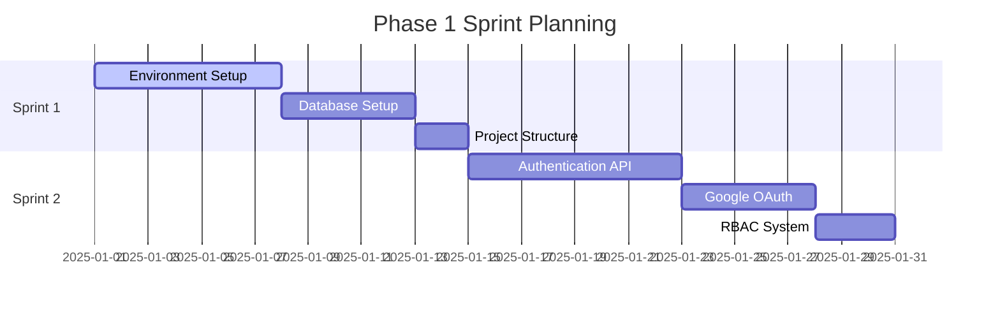

**🎯 Sprint 1 Goals**:

- ✅ Ubuntu VPS ready with Docker
- ✅ PostgreSQL + Redis operational
- ✅ Nginx SSL termination configured
- ✅ Project structure with microservices

**📋 Critical Tasks**:

1. **Server Provisioning** (Day 1-2)
   - Ubuntu 22.04 LTS installation
   - Docker Engine + Docker Compose
   - Basic security hardening
   - Domain and DNS configuration

2. **Database Infrastructure** (Day 3-5)
   - PostgreSQL 14+ installation
   - Redis 7+ for caching
   - Database schema creation
   - Connection pooling setup

3. **Development Environment** (Day 6-7)
   - Project repository structure
   - TypeScript configuration
   - Code quality tools (ESLint, Prettier)
   - Docker container setup

### Week 3-4: Authentication Core

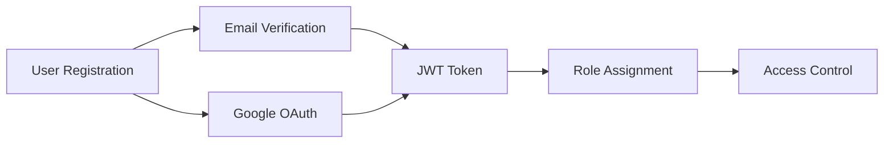

**🎯 Sprint 2 Goals**:

- ✅ Complete user authentication system
- ✅ Google OAuth integration working
- ✅ Role-based access control implemented
- ✅ JWT token management operational

**📋 Critical Tasks**:

1. **Authentication API** (Day 8-12)
   - User registration/login endpoints
   - Password hashing with bcrypt
   - JWT token generation/validation
   - Email verification system
   - Password reset flow

2. **OAuth Integration** (Day 13-15)
   - Google OAuth 2.0 setup
   - OAuth callback handling
   - Account linking logic
   - Error handling

3. **RBAC System** (Day 16-17)
   - Role and permission tables
   - Middleware for access control
   - Default role assignment
   - Admin role management

### Week 5-6: Credit System & MCP Foundation

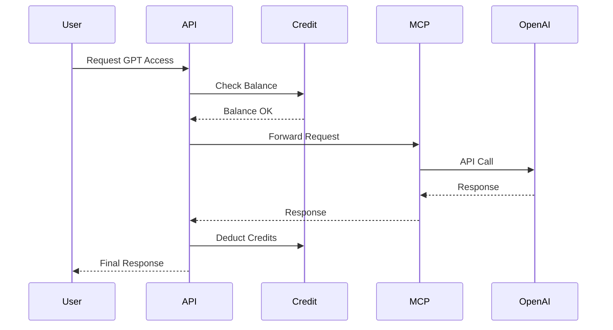

**🎯 Sprint 3 Goals**:

- ✅ Credit management system operational
- ✅ MCP server foundation complete
- ✅ OpenAI integration working
- ✅ Credit deduction on API usage

### Week 7-8: Complete MCP & Frontend Start

**🎯 Sprint 4 Goals**:

- ✅ Claude integration complete
- ✅ MCP authentication working
- ✅ React frontend foundation
- ✅ Credit top-up system

### Week 9-10: Frontend & Testing

**🎯 Sprint 5 Goals**:

- ✅ Complete user interface
- ✅ Admin dashboard functional
- ✅ Testing suite implemented
- ✅ Production deployment ready

---

## 🌐 Phase 2: Web-based Services (Weeks 11-18)

### Advanced Features Development

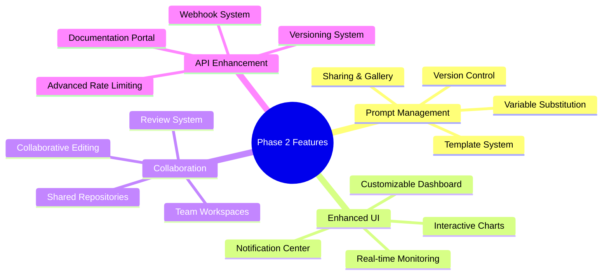

**🎯 Phase 2 Outcomes**:

- Professional prompt management system
- Advanced collaboration features
- Enhanced API with webhooks
- Comprehensive analytics dashboard

**📊 Success Metrics**:

- 50+ prompt templates created
- 5+ team collaborations active
- API documentation 100% complete
- User satisfaction > 4.0/5.0

---

## 🎨 Phase 3: Media Generation (Weeks 19-30)

### Multi-Provider Integration Strategy

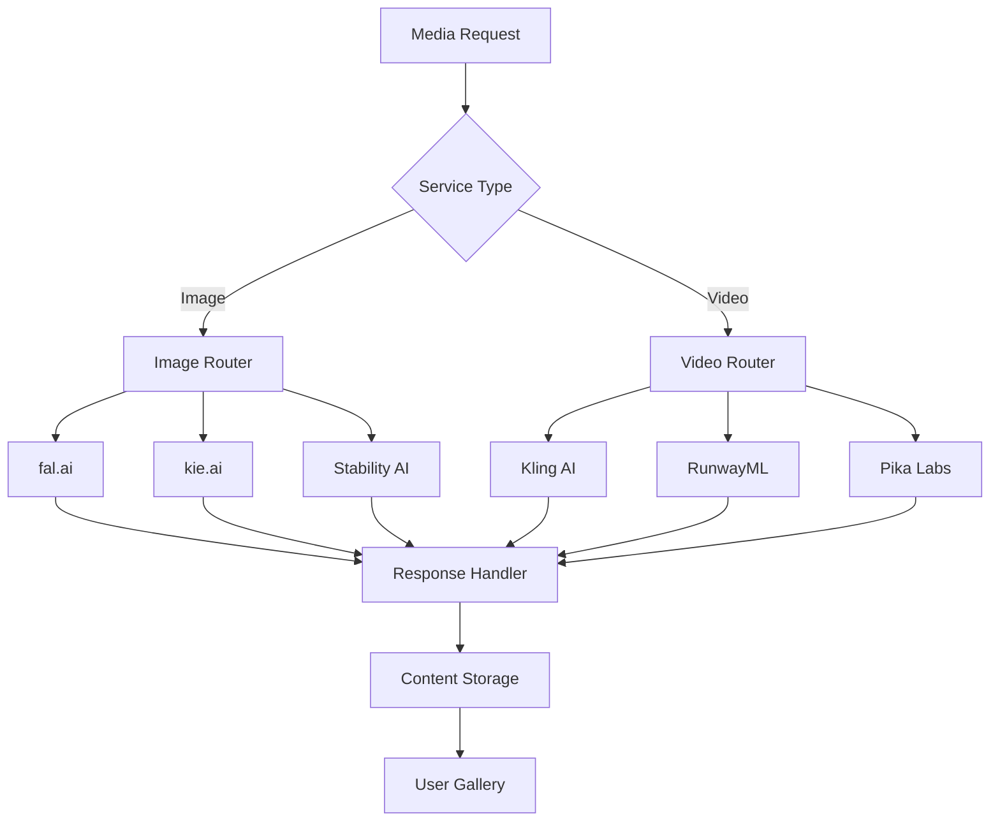

**🎯 Phase 3 Deliverables**:

- Multi-provider image generation
- Video generation capabilities
- Advanced content management
- Enterprise-grade features

---

## 📈 Development Timeline & Milestones

### Overall Project Timeline

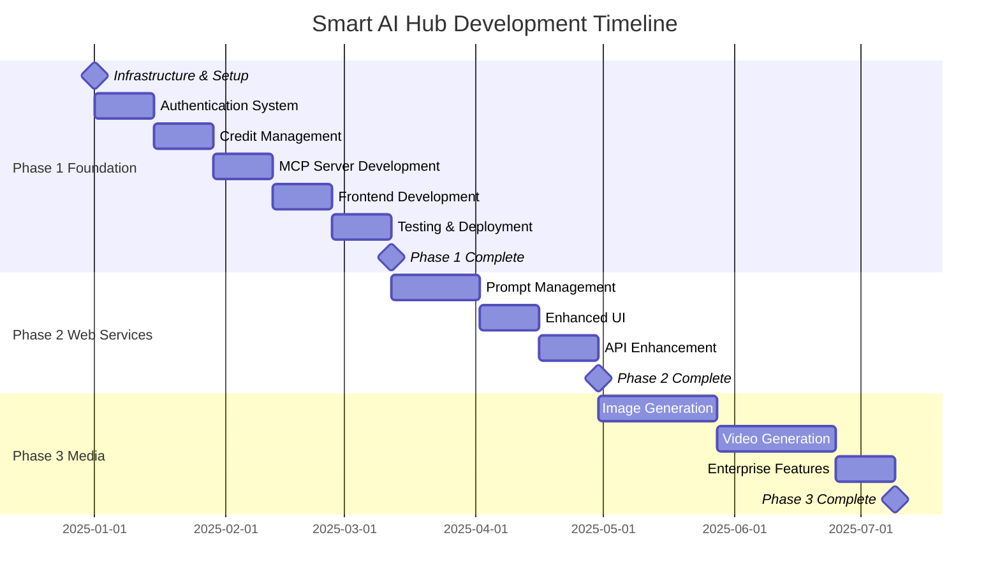

### 🗓️ Key Milestones & Checkpoints

#### Milestone 1: MVP Launch (Week 10)

**Deliverables**:

- ✅ Authentication system live
- ✅ Credit management operational
- ✅ Custom GPT access via MCP
- ✅ Basic web interface
- ✅ Admin dashboard functional

**Success Criteria**:

- 100+ registered users
- 500+ successful API calls
- 99%+ system uptime
- Zero critical security issues

#### Milestone 2: Web Services Launch (Week 18)

**Deliverables**:

- ✅ Prompt management system
- ✅ Team collaboration features
- ✅ Advanced analytics dashboard
- ✅ API v2 with webhooks
- ✅ Integration marketplace

**Success Criteria**:

- 50+ active prompt templates
- 10+ team workspaces
- API documentation complete
- User retention > 75%

#### Milestone 3: Media Platform Launch (Week 30)

**Deliverables**:

- ✅ Multi-provider image generation
- ✅ Video generation capabilities
- ✅ Enterprise SSO integration
- ✅ White-label solutions
- ✅ Advanced monitoring

**Success Criteria**:

- 1000+ images generated
- 100+ videos created
- Enterprise clients onboarded
- Revenue targets met

---

## 👥 Team Structure & Responsibilities

### Development Team Composition

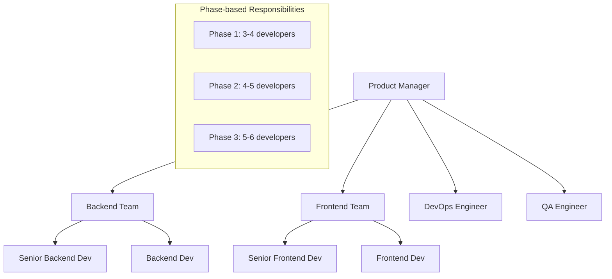

### 🎯 Role Responsibilities

**Product Manager**:

- Sprint planning and backlog management
- Stakeholder communication
- Feature prioritization
- Quality gate approval

**Senior Backend Developer**:

- Architecture decisions
- MCP server implementation
- Database design
- API security

**Backend Developer**:

- Microservice development
- Database integration
- Third-party API integration
- Testing implementation

**Senior Frontend Developer**:

- UI/UX architecture
- Component library design
- State management
- Performance optimization

**Frontend Developer**:

- Component development
- Integration with backend APIs
- Responsive design implementation
- User experience testing

**DevOps Engineer**:

- Infrastructure management
- CI/CD pipeline setup
- Monitoring and alerting
- Security compliance

**QA Engineer**:

- Test case development
- Automated testing setup
- Performance testing
- Security testing

---

## 🛠️ Technical Implementation Strategy

### Development Workflow

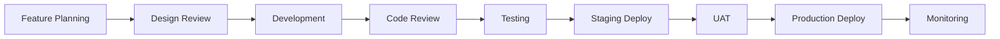

### 🔧 CI/CD Pipeline

```yaml
# GitHub Actions Workflow
name: Smart AI Hub CI/CD
on:
  push:
    branches: [main, develop]
  pull_request:
    branches: [main]

jobs:
  test:
    runs-on: ubuntu-latest
    steps:
      - Checkout code
      - Setup Node.js
      - Install dependencies
      - Run unit tests
      - Run integration tests
      - Generate coverage report

  build:
    needs: test
    runs-on: ubuntu-latest
    steps:
      - Build Docker images
      - Push to registry
      - Security scanning

  deploy:
    needs: build
    runs-on: ubuntu-latest
    steps:
      - Deploy to staging
      - Run smoke tests
      - Deploy to production
      - Health check verification
```

### 🧪 Testing Strategy

```mermaid
pyramid
    title Testing Pyramid

    component E2E Tests
    component Integration Tests
    component Unit Tests

    description Unit Tests
      "70% coverage - Fast execution"
      "Component logic testing"
      "Database layer testing"

    description Integration Tests
      "20% coverage - API testing"
      "Service communication"
      "Database integration"

    description E2E Tests
      "10% coverage - User flows"
      "Critical path testing"
      "Cross-browser testing"
```

---

## 🔒 Security Implementation Plan

### Security Measures Timeline

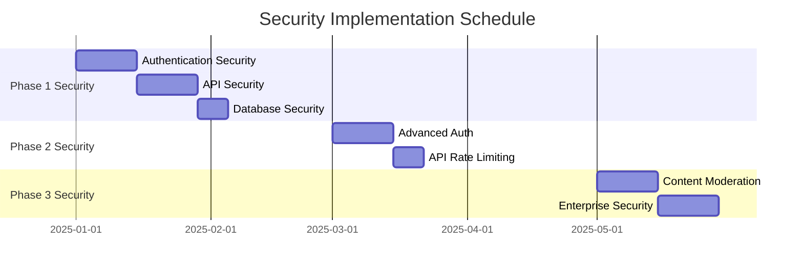

### 🛡️ Security Checklist by Phase

#### Phase 1 Security Requirements

- ✅ JWT token security with RS256
- ✅ Password hashing with bcrypt
- ✅ SQL injection prevention
- ✅ XSS protection headers
- ✅ HTTPS/TLS enforcement
- ✅ Input validation middleware
- ✅ Rate limiting basic implementation

#### Phase 2 Security Enhancements

- ✅ Advanced rate limiting with tiers
- ✅ API key management system
- ✅ Webhook signature validation
- ✅ Enhanced audit logging
- ✅ Session management improvements

#### Phase 3 Enterprise Security

- ✅ SSO integration (SAML)
- ✅ Content moderation system
- ✅ Advanced threat detection
- ✅ Compliance reporting
- ✅ Data encryption at rest

---

## 📊 Monitoring & Analytics Strategy

### Monitoring Dashboard Overview

```mermaid
dashboard
    title System Monitoring Dashboard

    widget metrics1
        title "System Health"
        type gauge
        data [
            {name: "CPU Usage", value: 65, max: 100},
            {name: "Memory", value: 78, max: 100},
            {name: "Disk Space", value: 45, max: 100}
        ]

    widget metrics2
        title "API Performance"
        type line
        data [
            {time: "00:00", response: 120},
            {time: "06:00", response: 85},
            {time: "12:00", response: 150},
            {time: "18:00", response: 95}
        ]

    widget metrics3
        title "User Activity"
        type bar
        data [
            {day: "Mon", users: 1200},
            {day: "Tue", users: 1350},
            {day: "Wed", users: 1100},
            {day: "Thu", users: 1400}
        ]
```

### 📈 KPI Tracking by Phase

#### Phase 1 KPIs

- System uptime: > 99.5%
- API response time: < 200ms
- User registration rate: > 70%
- Credit system accuracy: 100%

#### Phase 2 KPIs

- Template creation rate: 5+ per day
- User engagement: > 60% daily active
- API adoption: 50+ integrations
- Team collaboration: 10+ workspaces

#### Phase 3 KPIs

- Media generation success: > 95%
- Content moderation accuracy: > 90%
- Enterprise feature adoption: 20+ clients
- Revenue growth: 25% month-over-month

---

## 💰 Budget & Resource Planning

### Development Cost Breakdown

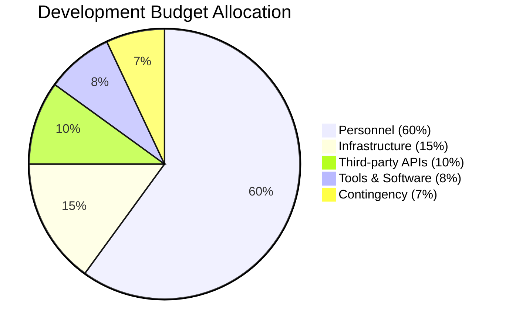

### 💸 Monthly Operating Costs

| Category              | Phase 1  | Phase 2    | Phase 3    |
| --------------------- | -------- | ---------- | ---------- |
| Server Infrastructure | $200     | $500       | $1,200     |
| Database Hosting      | $150     | $300       | $600       |
| Third-party APIs      | $300     | $800       | $2,000     |
| CDN & Storage         | $50      | $200       | $500       |
| Monitoring Tools      | $100     | $200       | $400       |
| **Total Monthly**     | **$800** | **$2,000** | **$4,700** |

---

## 🚀 Deployment & Go-Live Strategy

### Production Deployment Checklist

#### Pre-Deployment (Week before)

- [ ] Final security audit completed
- [ ] Load testing passed
- [ ] Database migration scripts tested
- [ ] Backup and recovery procedures verified
- [ ] Monitoring and alerting configured
- [ ] Documentation updated
- [ ] Team training completed

#### Deployment Day

- [ ] Maintenance window scheduled
- [ ] Database migrations executed
- [ ] Application deployment completed
- [ ] SSL certificates verified
- [ ] DNS configuration updated
- [ ] Smoke tests passed
- [ ] Monitoring dashboards active

#### Post-Deployment (First week)

- [ ] System performance monitored
- [ ] User feedback collected
- [ ] Bug reports triaged
- [ ] Performance metrics analyzed
- [ ] Success metrics tracked
- [ ] Team retrospective conducted

### 🎯 Success Criteria for Go-Live

#### Phase 1 Launch Success

- Zero critical bugs in first 48 hours
- < 200ms average API response time
- 100+ user registrations in first week
- 95%+ authentication success rate

#### Phase 2 Launch Success

- 50+ prompt templates created in first month
- 10+ team workspaces active
- API documentation 100% complete
- User satisfaction score > 4.0/5.0

#### Phase 3 Launch Success

- 1,000+ media assets generated in first month
- 5+ enterprise clients onboarded
- Content moderation 95%+ accuracy
- Revenue targets achieved

---

## 🔄 Continuous Improvement Plan

### Feedback Loop Implementation

```mermaid
cycle
    title Continuous Improvement Cycle

    Collect --> Analyze
    Analyze --> Plan
    Plan --> Implement
    Implement --> Monitor
    Monitor --> Collect

    note Collect "User feedback, Analytics data, Performance metrics"
    note Analyze "Identify trends, Pain points, Opportunities"
    note Plan "Feature roadmap, Technical improvements, Resource allocation"
    note Implement "Development sprints, Testing, Deployment"
    note Monitor "KPI tracking, System health, User satisfaction"
```

### 📋 Monthly Review Process

1. **Performance Review** (Week 1)
   - System performance analysis
   - User activity metrics
   - Cost optimization review

2. **Feature Assessment** (Week 2)
   - Feature usage analytics
   - User feedback analysis
   - Roadmap adjustments

3. **Technical Debt Review** (Week 3)
   - Code quality assessment
   - Infrastructure optimization
   - Security updates

4. **Strategic Planning** (Week 4)
   - Market analysis
   - Competitive review
   - Future roadmap planning

---

## 📞 Communication & Reporting

### Stakeholder Communication Plan

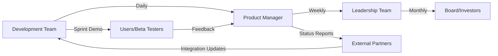

### 📊 Reporting Schedule

#### Daily Reports

- Development team standup
- Build and deployment status
- Critical issue alerts
- Performance metrics summary

#### Weekly Reports

- Sprint progress review
- Feature completion status
- User feedback summary
- System health overview

#### Monthly Reports

- Phase milestone progress
- Budget and resource utilization
- User growth and engagement
- Technical debt assessment

#### Quarterly Reviews

- Strategic roadmap assessment
- Market analysis update
- Competitive positioning review
- Investment and scaling plans

---

This comprehensive development plan canvas provides a complete roadmap for building the AI Service Hub platform across all three phases, with detailed timelines, responsibilities, and success metrics for each stage of development.
