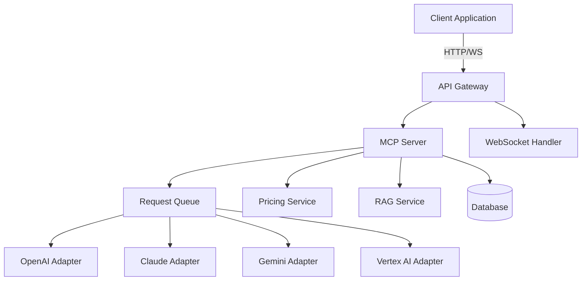

# Kilo Code Prompt: ปรับปรุง EPIC-006 AI Integration Spec

**วันที่**: 18 ตุลาคม 2025  
**งาน**: ปรับปรุง spec ของ EPIC-006: AI Integration & Model Context Protocol ให้สมบูรณ์  
**Repository**: https://github.com/naibarn/Smart-AI-Hub

---

## 📋 วัตถุประสงค์

ปรับปรุงไฟล์ `specs/006-ai-integration/spec.md` ให้สมบูรณ์และทันสมัย โดยเพิ่มเติมส่วนที่ขาดหายไปและอัปเดตให้สอดคล้องกับเทคโนโลยีและระบบใหม่ๆ ที่กำลังจะเพิ่มเข้ามา

---

## 🎯 งานที่ต้องทำ

### Phase 1: อัปเดต Metadata และ User Stories

#### Task 1.1: อัปเดต Metadata
- [ ] อัปเดต `updated_at` เป็นวันที่ปัจจุบัน (2025-10-18)
- [ ] เพิ่ม tags: `'mcp-server'`, `'agent-skills'`, `'custom-gpt'`, `'gemini-gems'`, `'claude-skills'`, `'vertex-ai'`
- [ ] อัปเดต `related_specs` เพิ่ม:
  - `'FR-PRICING-001: Agent Skills Pricing System'`
  - `'FR-RAG-001: RAG System Integration'`
  - `'FR-SKILLS-001: Agent Skills Marketplace'`

#### Task 1.2: ปรับปรุง User Stories ให้เป็นรูปแบบมาตรฐาน

**รูปแบบเดิม** (ไม่ดี):
```markdown
### As a user, I want to interact with different AI models through a unified interface so that I can leverage the best AI capabilities for my needs.
```

**รูปแบบใหม่** (ดี):
```markdown
### US-001: Unified AI Model Interface

**As a** platform user  
**I want to** interact with different AI models (OpenAI, Claude, Gemini, etc.) through a single unified interface  
**So that** I can leverage the best AI capabilities for my specific needs without learning multiple APIs

#### Acceptance Scenarios

**Scenario 1: User selects AI model**
- **Given** I am logged into the platform
- **When** I select an AI model from the dropdown
- **Then** the interface should adapt to show model-specific options
- **And** I should see the estimated cost for my request

**Scenario 2: Automatic fallback on provider failure**
- **Given** I have submitted a request to OpenAI
- **When** OpenAI service is unavailable
- **Then** the system should automatically fallback to Claude
- **And** I should be notified about the provider switch
- **And** my request should be processed without interruption
```

**ปรับปรุง User Stories ทั้งหมด 6 เรื่องให้เป็นรูปแบบนี้**

#### Task 1.3: เพิ่ม User Stories ใหม่

เพิ่ม User Stories สำหรับฟีเจอร์ใหม่:

**US-007: Custom GPT Integration**
```markdown
### US-007: Custom GPT Integration

**As a** Custom GPT creator  
**I want to** integrate my Custom GPT with Smart-AI-Hub  
**So that** I can leverage the platform's features (RAG, pricing, analytics)

#### Acceptance Scenarios

**Scenario 1: Connect Custom GPT**
- **Given** I have created a Custom GPT on OpenAI
- **When** I provide the GPT ID and API key
- **Then** the system should validate the connection
- **And** my Custom GPT should appear in my agent list

**Scenario 2: Use Custom GPT with RAG**
- **Given** I have connected my Custom GPT
- **When** I enable RAG for this GPT
- **Then** the GPT should have access to my documents
- **And** responses should include relevant context from my knowledge base
```

**US-008: Gemini Gems Integration**
**US-009: Claude Skills Integration**
**US-010: Vertex AI Agent Builder Integration**
**US-011: MCP Server Support**

(เขียนแบบเดียวกับ US-007)

### Phase 2: อัปเดต Acceptance Criteria

#### Task 2.1: จัดกลุ่ม Acceptance Criteria ใหม่

เพิ่มกลุ่มใหม่:

**Agent Platforms Integration** (6 criteria):
- [ ] System supports Custom GPT integration
- [ ] System supports Gemini Gems integration
- [ ] System supports Claude Skills integration
- [ ] System supports Vertex AI Agent Builder integration
- [ ] Platform switching is transparent to end users
- [ ] Platform-specific features are properly handled

**MCP Server Implementation** (5 criteria):
- [ ] MCP server follows Anthropic specification
- [ ] Claude Desktop can connect to the server
- [ ] Tools are properly registered and callable
- [ ] Resources are accessible via MCP protocol
- [ ] Prompts are available for common tasks

**RAG Integration** (5 criteria):
- [ ] Agents can access documents from RAG system
- [ ] Access control is properly enforced
- [ ] Context is injected before LLM calls
- [ ] Semantic search results are relevant
- [ ] RAG costs are tracked and billed

**Pricing Integration** (5 criteria):
- [ ] Cost estimation is available before requests
- [ ] Credits are reserved before expensive operations
- [ ] Actual usage is tracked accurately
- [ ] Nested agent calls are properly billed
- [ ] Usage logs include all cost components

#### Task 2.2: เพิ่มตัวเลขชัดเจนใน Performance Requirements

**เดิม**:
```markdown
- [ ] Response times meet performance requirements
```

**ใหม่**:
```markdown
- [ ] WebSocket connection establishment < 100ms (p95)
- [ ] First token latency < 200ms (p95)
- [ ] Streaming throughput > 100 tokens/second
- [ ] Provider fallback time < 2 seconds
- [ ] API response time < 500ms for non-streaming (p95)
```

### Phase 3: เพิ่ม Technical Requirements

#### Task 3.1: เพิ่ม Data Models สำหรับ Agent Platforms

เพิ่ม TypeScript interfaces:

```typescript
// Custom GPT
interface CustomGPTConfig {
  gptId: string;
  name: string;
  description: string;
  instructions: string;
  tools: CustomGPTTool[];
  fileIds?: string[];
  metadata: Record<string, any>;
}

// Gemini Gem
interface GeminiGemConfig {
  gemId: string;
  name: string;
  description: string;
  systemInstruction: string;
  tools: GeminiTool[];
  groundingConfig?: GroundingConfig;
}

// Claude Skill
interface ClaudeSkillConfig {
  skillId: string;
  name: string;
  description: string;
  instructions: string;
  tools: ClaudeTool[];
  mcpServers?: MCPServerConfig[];
}

// Vertex AI Agent
interface VertexAIAgentConfig {
  agentId: string;
  projectId: string;
  location: string;
  dataStores: string[];
  tools: VertexAITool[];
}
```

#### Task 3.2: เพิ่ม API Endpoints สำหรับ Agent Platforms

เพิ่ม REST endpoints:

```markdown
#### Custom GPT Endpoints
- **Connect GPT**: `POST /api/mcp/custom-gpt/connect`
- **List GPTs**: `GET /api/mcp/custom-gpt`
- **Execute GPT**: `POST /api/mcp/custom-gpt/:gptId/execute`
- **Disconnect GPT**: `DELETE /api/mcp/custom-gpt/:gptId`

#### Gemini Gems Endpoints
- **Connect Gem**: `POST /api/mcp/gemini-gems/connect`
- **List Gems**: `GET /api/mcp/gemini-gems`
- **Execute Gem**: `POST /api/mcp/gemini-gems/:gemId/execute`
- **Disconnect Gem**: `DELETE /api/mcp/gemini-gems/:gemId`

#### Claude Skills Endpoints
- **Connect Skill**: `POST /api/mcp/claude-skills/connect`
- **List Skills**: `GET /api/mcp/claude-skills`
- **Execute Skill**: `POST /api/mcp/claude-skills/:skillId/execute`
- **Disconnect Skill**: `DELETE /api/mcp/claude-skills/:skillId`

#### Vertex AI Endpoints
- **Connect Agent**: `POST /api/mcp/vertex-ai/connect`
- **List Agents**: `GET /api/mcp/vertex-ai`
- **Execute Agent**: `POST /api/mcp/vertex-ai/:agentId/execute`
- **Disconnect Agent**: `DELETE /api/mcp/vertex-ai/:agentId`

#### MCP Server Endpoints
- **List Tools**: `GET /api/mcp/server/tools`
- **List Resources**: `GET /api/mcp/server/resources`
- **List Prompts**: `GET /api/mcp/server/prompts`
- **Call Tool**: `POST /api/mcp/server/tools/:toolName`
- **Read Resource**: `GET /api/mcp/server/resources/:resourceUri`
```

### Phase 4: เพิ่ม Integration Guides

#### Task 4.1: สร้าง Integration Guide สำหรับ Pricing System

เพิ่มส่วนใหม่:

```markdown
## Integration with Pricing System (FR-PRICING-001)

### Overview

The AI Integration service integrates with the Pricing System to provide accurate cost estimation, credit reservation, and usage tracking for all AI operations.

### Integration Flow

1. **Before AI Request**:
   ```typescript
   // Estimate cost
   const estimation = await pricingService.estimate({
     platform: 'openai',
     model: 'gpt-4',
     inputTokens: request.messages.reduce((sum, m) => sum + m.content.length / 4, 0),
     outputTokens: request.maxTokens || 1000,
     features: request.enableRAG ? ['rag'] : []
   });
   
   // Reserve credits
   const reservation = await creditReservationService.reserve({
     userId: request.userId,
     amount: estimation.totalCost,
     reason: `AI request: ${request.model}`
   });
   ```

2. **During AI Request**:
   ```typescript
   // Execute request
   const response = await mcpService.execute(request);
   ```

3. **After AI Request**:
   ```typescript
   // Deduct actual cost
   await pricingService.deduct({
     userId: request.userId,
     reservationId: reservation.id,
     actualUsage: {
       inputTokens: response.usage.promptTokens,
       outputTokens: response.usage.completionTokens,
       features: response.metadata.features
     }
   });
   
   // Log usage
   await usageTrackingService.log({
     userId: request.userId,
     platform: response.metadata.provider,
     model: response.metadata.model,
     usage: response.usage,
     cost: response.usage.credits
   });
   ```

### Error Handling

If the AI request fails, credits are released:

```typescript
try {
  const response = await mcpService.execute(request);
  await pricingService.deduct(...);
} catch (error) {
  await creditReservationService.release(reservation.id);
  throw error;
}
```
```

#### Task 4.2: สร้าง Integration Guide สำหรับ RAG System

(เขียนแบบเดียวกับ Pricing System)

#### Task 4.3: สร้าง Integration Guide สำหรับ Skills Marketplace

(เขียนแบบเดียวกับ Pricing System)

### Phase 5: เพิ่ม Documentation

#### Task 5.1: สร้าง OpenAPI Specification

สร้างไฟล์ `specs/006-ai-integration/contracts/openapi.yaml`:

```yaml
openapi: 3.0.0
info:
  title: AI Integration & MCP API
  version: 1.0.0
  description: API for interacting with various AI providers and MCP server

servers:
  - url: http://localhost:3003
    description: Development server

paths:
  /api/mcp/sora2/generate:
    post:
      summary: Generate video from text
      tags:
        - Video Generation
      requestBody:
        required: true
        content:
          application/json:
            schema:
              $ref: '#/components/schemas/Sora2VideoRequest'
      responses:
        '200':
          description: Video generation started
          content:
            application/json:
              schema:
                $ref: '#/components/schemas/Sora2VideoResponse'
        '400':
          description: Invalid request
        '401':
          description: Unauthorized
        '402':
          description: Insufficient credits

components:
  schemas:
    Sora2VideoRequest:
      type: object
      required:
        - prompt
        - duration
        - resolution
      properties:
        prompt:
          type: string
          description: Text prompt for video generation
          example: "A beautiful sunset over the ocean"
        duration:
          type: integer
          description: Video duration in seconds
          minimum: 1
          maximum: 60
          example: 10
        resolution:
          type: string
          enum: ['720p', '1080p', '4K']
          example: '1080p'
        style:
          type: string
          description: Visual style
          example: "cinematic"
        aspectRatio:
          type: string
          example: "16:9"

    Sora2VideoResponse:
      type: object
      properties:
        videoId:
          type: string
          example: "vid_abc123"
        status:
          type: string
          enum: ['processing', 'completed', 'failed']
          example: "processing"
        url:
          type: string
          nullable: true
          example: "https://cdn.example.com/videos/vid_abc123.mp4"
        thumbnailUrl:
          type: string
          nullable: true
        duration:
          type: integer
          example: 10
        creditsUsed:
          type: number
          example: 150.5
        createdAt:
          type: string
          format: date-time
        completedAt:
          type: string
          format: date-time
          nullable: true

  securitySchemes:
    bearerAuth:
      type: http
      scheme: bearer
      bearerFormat: JWT

security:
  - bearerAuth: []
```

(ทำครบทุก endpoint)

#### Task 5.2: สร้าง Architecture Diagrams

สร้างไฟล์ `specs/006-ai-integration/diagrams/` พร้อม diagrams:

1. **system-architecture.mmd** (Mermaid diagram):


2. **sequence-diagram.mmd** (Sequence diagram สำหรับ AI request flow)

3. **component-diagram.mmd** (Component diagram)

4. **deployment-diagram.mmd** (Deployment diagram)

#### Task 5.3: เพิ่ม Implementation Timeline

เพิ่มส่วน:

```markdown
## Implementation Timeline

### Phase 1: Foundation (Weeks 1-8)
**Duration**: 2 months  
**Team**: 2 developers

#### Week 1-2: Complete Existing Features
- [ ] Finish all unchecked acceptance criteria
- [ ] Fix known bugs
- [ ] Implement circuit breaker
- [ ] Add comprehensive error handling

#### Week 3-4: Pricing Integration
- [ ] Integrate with FR-PRICING-001
- [ ] Implement cost estimation
- [ ] Implement credit reservation
- [ ] Add usage tracking

#### Week 5-6: Technology Upgrade
- [ ] Upgrade Express.js to 5.x or migrate to Fastify
- [ ] Update dependencies
- [ ] Refactor for better performance
- [ ] Add caching layer

#### Week 7-8: Testing & Documentation
- [ ] Write unit tests (target: 80% coverage)
- [ ] Write integration tests
- [ ] Create OpenAPI specification
- [ ] Update documentation

### Phase 2: Agent Platforms (Weeks 9-16)
**Duration**: 2 months  
**Team**: 2 developers

#### Week 9-10: Custom GPT
- [ ] Implement Custom GPT adapter
- [ ] Add API endpoints
- [ ] Test integration
- [ ] Document usage

#### Week 11-12: Gemini Gems
- [ ] Implement Gemini Gems adapter
- [ ] Add API endpoints
- [ ] Test integration
- [ ] Document usage

#### Week 13-14: Claude Skills
- [ ] Implement Claude Skills adapter
- [ ] Add API endpoints
- [ ] Test integration
- [ ] Document usage

#### Week 15-16: Vertex AI Agent Builder
- [ ] Implement Vertex AI adapter
- [ ] Add API endpoints
- [ ] Test integration
- [ ] Document usage

### Phase 3: RAG & MCP (Weeks 17-24)
**Duration**: 2 months  
**Team**: 2 developers

#### Week 17-18: RAG Integration
- [ ] Integrate with FR-RAG-001
- [ ] Implement context injection
- [ ] Test access control
- [ ] Optimize performance

#### Week 19-20: MCP Server
- [ ] Implement MCP server (Anthropic spec)
- [ ] Register tools
- [ ] Register resources
- [ ] Test with Claude Desktop

#### Week 21-22: Advanced Features
- [ ] Add multi-modal support
- [ ] Implement response caching
- [ ] Add agent workflows
- [ ] Optimize costs

#### Week 23-24: Final Testing & Deployment
- [ ] E2E testing
- [ ] Performance testing
- [ ] Security testing
- [ ] Production deployment

**Total Duration**: 6 months  
**Total Cost**: ~1.06M THB
```

### Phase 6: เพิ่ม Testing Details

#### Task 6.1: กำหนด Test Coverage Targets

เพิ่มส่วน:

```markdown
## Testing Strategy (Detailed)

### Test Coverage Targets

| Test Type | Target Coverage | Tools |
|-----------|----------------|-------|
| Unit Tests | 80% | Jest, ts-jest |
| Integration Tests | 70% | Jest, Supertest |
| E2E Tests | 50% | Playwright |
| API Tests | 100% | Postman, Newman |

### Test Automation

#### CI/CD Pipeline

```yaml
# .github/workflows/test.yml
name: Test AI Integration

on: [push, pull_request]

jobs:
  test:
    runs-on: ubuntu-latest
    steps:
      - uses: actions/checkout@v4
      - uses: actions/setup-node@v4
        with:
          node-version: 22
      
      - name: Install dependencies
        run: npm ci
      
      - name: Run linter
        run: npm run lint
      
      - name: Run unit tests
        run: npm run test:unit -- --coverage
      
      - name: Run integration tests
        run: npm run test:integration
      
      - name: Upload coverage
        uses: codecov/codecov-action@v3
```

### Test Scenarios

#### Unit Tests

**Provider Adapters**:
- [ ] OpenAI adapter handles successful requests
- [ ] OpenAI adapter handles rate limiting
- [ ] OpenAI adapter handles API errors
- [ ] Claude adapter handles successful requests
- [ ] Fallback mechanism works correctly

**WebSocket Handler**:
- [ ] Connection establishment
- [ ] Message parsing
- [ ] Streaming responses
- [ ] Connection cleanup
- [ ] Error handling

**Circuit Breaker**:
- [ ] Opens on repeated failures
- [ ] Closes after timeout
- [ ] Half-open state works
- [ ] Metrics are tracked

#### Integration Tests

**End-to-End Flows**:
- [ ] Complete AI request flow (request → response)
- [ ] Provider fallback on failure
- [ ] Credit reservation and deduction
- [ ] RAG context injection
- [ ] Video generation workflow

**API Tests**:
- [ ] All endpoints return correct status codes
- [ ] Request validation works
- [ ] Authentication is enforced
- [ ] Rate limiting works
- [ ] Error responses are consistent
```

### Phase 7: เพิ่ม Deployment Details

#### Task 7.1: เพิ่ม Rollback Plan

เพิ่มส่วน:

```markdown
## Deployment Strategy

### Blue-Green Deployment

1. **Setup**:
   - Maintain two identical environments (Blue and Green)
   - Blue = current production
   - Green = new version

2. **Deployment Process**:
   ```bash
   # Deploy to Green environment
   npm run deploy:green
   
   # Run smoke tests
   npm run test:smoke -- --env=green
   
   # Switch traffic to Green (gradual)
   kubectl patch service mcp-service -p '{"spec":{"selector":{"version":"green"}}}'
   
   # Monitor metrics for 30 minutes
   npm run monitor -- --duration=30m
   
   # If successful, Green becomes new Blue
   # If failed, rollback to Blue
   ```

3. **Rollback**:
   ```bash
   # Immediate rollback
   kubectl patch service mcp-service -p '{"spec":{"selector":{"version":"blue"}}}'
   ```

### Canary Deployment

1. **Setup**:
   - Deploy new version to small subset of servers (10%)
   - Monitor metrics closely

2. **Gradual Rollout**:
   - 10% → 25% → 50% → 100%
   - Each step requires 1 hour of stable metrics

3. **Rollback Triggers**:
   - Error rate > 1%
   - Response time > 2x baseline
   - Circuit breaker activations > 5/minute
   - Manual trigger

### Feature Flags

Use feature flags for risky changes:

```typescript
if (featureFlags.isEnabled('new-claude-adapter', userId)) {
  return newClaudeAdapter.execute(request);
} else {
  return oldClaudeAdapter.execute(request);
}
```
```

---

## 📝 คำแนะนำสำหรับ Kilo Code

### ขั้นตอนการทำงาน

1. **อ่านไฟล์ spec ปัจจุบัน**:
   - `specs/006-ai-integration/spec.md`

2. **อ่านไฟล์อ้างอิง**:
   - `specs/014-agent-skills-rag-system/FR-PRICING-001-Agent-Skills-Pricing-System.md`
   - `specs/014-agent-skills-rag-system/FR-RAG-001-RAG-System-Integration.md`
   - `specs/014-agent-skills-rag-system/FR-SKILLS-001-Agent-Skills-Marketplace.md`

3. **ปรับปรุงไฟล์ spec ตาม tasks ทั้งหมดข้างต้น**

4. **สร้างไฟล์เพิ่มเติม**:
   - `specs/006-ai-integration/contracts/openapi.yaml`
   - `specs/006-ai-integration/diagrams/system-architecture.mmd`
   - `specs/006-ai-integration/diagrams/sequence-diagram.mmd`
   - `specs/006-ai-integration/diagrams/component-diagram.mmd`
   - `specs/006-ai-integration/diagrams/deployment-diagram.mmd`

5. **Validate**:
   - ตรวจสอบว่า markdown syntax ถูกต้อง
   - ตรวจสอบว่า links ทั้งหมดใช้งานได้
   - ตรวจสอบว่า code examples ถูกต้อง
   - ตรวจสอบว่า YAML syntax ถูกต้อง (OpenAPI spec)
   - ตรวจสอบว่า Mermaid diagrams render ได้

### หลักการสำคัญ

1. **ความสมบูรณ์**: ครอบคลุมทุกด้านที่จำเป็น
2. **ความชัดเจน**: อธิบายให้เข้าใจง่าย มีตัวอย่าง
3. **ความทันสมัย**: ใช้เทคโนโลยีและ best practices ล่าสุด
4. **ความเชื่อมโยง**: Integrate กับ specs อื่นๆ อย่างชัดเจน
5. **ความสามารถในการทดสอบ**: ทุก requirement ต้อง testable

### คุณภาพที่คาดหวัง

- ✅ User stories ครบถ้วน มี acceptance scenarios
- ✅ Acceptance criteria ชัดเจน measurable
- ✅ Technical requirements ละเอียด มี code examples
- ✅ Integration guides ครบทุก integration point
- ✅ OpenAPI specification สมบูรณ์
- ✅ Architecture diagrams ชัดเจน
- ✅ Testing strategy ครบถ้วน มี coverage targets
- ✅ Deployment strategy มี rollback plan
- ✅ Timeline realistic มี resource estimation

---

## ✅ Checklist

### Phase 1: Metadata & User Stories
- [ ] อัปเดต metadata (updated_at, tags, related_specs)
- [ ] ปรับปรุง user stories 6 เรื่องให้เป็นรูปแบบมาตรฐาน
- [ ] เพิ่ม user stories ใหม่ 5 เรื่อง (US-007 ถึง US-011)

### Phase 2: Acceptance Criteria
- [ ] เพิ่มกลุ่ม criteria ใหม่ 4 กลุ่ม
- [ ] เพิ่มตัวเลขชัดเจนใน performance requirements
- [ ] อัปเดต status (check ✅ ข้อที่เสร็จแล้ว)

### Phase 3: Technical Requirements
- [ ] เพิ่ม data models สำหรับ agent platforms
- [ ] เพิ่ม API endpoints สำหรับ agent platforms
- [ ] เพิ่ม API endpoints สำหรับ MCP server

### Phase 4: Integration Guides
- [ ] สร้าง integration guide สำหรับ Pricing System
- [ ] สร้าง integration guide สำหรับ RAG System
- [ ] สร้าง integration guide สำหรับ Skills Marketplace

### Phase 5: Documentation
- [ ] สร้าง OpenAPI specification
- [ ] สร้าง architecture diagrams (4 diagrams)
- [ ] เพิ่ม implementation timeline

### Phase 6: Testing
- [ ] กำหนด test coverage targets
- [ ] เพิ่ม test automation plan
- [ ] เพิ่ม test scenarios

### Phase 7: Deployment
- [ ] เพิ่ม blue-green deployment strategy
- [ ] เพิ่ม canary deployment strategy
- [ ] เพิ่ม rollback plan
- [ ] เพิ่ม feature flags strategy

---

## 🎯 Expected Output

หลังจาก Kilo Code ทำเสร็จ จะได้:

### 1. Updated Spec File
```
specs/006-ai-integration/spec.md  # ปรับปรุงแล้ว ~2x ขนาดเดิม
```

### 2. New Files
```
specs/006-ai-integration/
├── contracts/
│   └── openapi.yaml  # OpenAPI 3.0 specification
└── diagrams/
    ├── system-architecture.mmd
    ├── sequence-diagram.mmd
    ├── component-diagram.mmd
    └── deployment-diagram.mmd
```

### 3. Quality Metrics
- Completeness score: 85/100 (เพิ่มจาก 65)
- User stories: 11 (เพิ่มจาก 6)
- Acceptance criteria: 51 (เพิ่มจาก 25)
- Integration guides: 3 (ใหม่)
- Diagrams: 4 (ใหม่)
- OpenAPI endpoints: 20+ (ใหม่)

---

## 📊 Summary

| Item | Before | After | Improvement |
|------|--------|-------|-------------|
| Completeness Score | 65/100 | 85/100 | +31% |
| User Stories | 6 | 11 | +83% |
| Acceptance Criteria | 25 | 51 | +104% |
| Integration Guides | 0 | 3 | New |
| Architecture Diagrams | 0 | 4 | New |
| OpenAPI Spec | No | Yes | New |
| Test Coverage Target | No | Yes | New |
| Deployment Strategy | Basic | Complete | +200% |

---

**พร้อมเริ่มปรับปรุง spec แล้ว!** 🚀

แค่ให้ Kilo Code อ่าน prompt นี้พร้อมไฟล์ spec ปัจจุบันและไฟล์อ้างอิง จะได้ spec ที่สมบูรณ์และพร้อมใช้งาน

