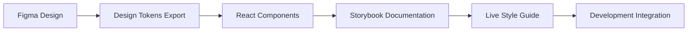

# Smart AI Hub - UI/UX Design Guidelines

## 🎨 Design System Overview

### Design Philosophy
**Vision**: สร้าง Interface ที่เป็น **Intelligent, Intuitive, และ Inspiring**
- **Intelligent**: ใช้ AI ช่วยในการออกแบบ UX ที่เข้าใจผู้ใช้
- **Intuitive**: การออกแบบที่เข้าใจง่าย ไม่ซับซ้อน
- **Inspiring**: สวยงาม ทันสมัย สร้างแรงบันดาลใจ

### 🎯 Modern Design Trends 2025

#### 1. **Neomorphism + Glassmorphism Hybrid**
```css
/* Glass Effect Components */
.glass-card {
  background: rgba(255, 255, 255, 0.1);
  backdrop-filter: blur(10px);
  border: 1px solid rgba(255, 255, 255, 0.2);
  border-radius: 16px;
  box-shadow: 
    0 8px 32px rgba(0, 0, 0, 0.1),
    inset 0 1px 0 rgba(255, 255, 255, 0.2);
}

/* Soft Neumorphism for Buttons */
.neu-button {
  background: #f0f0f3;
  box-shadow: 
    6px 6px 12px #d1d1d4,
    -6px -6px 12px #ffffff;
  border-radius: 12px;
  transition: all 0.3s cubic-bezier(0.4, 0, 0.2, 1);
}
```

#### 2. **AI-Inspired Gradient System**
```css
/* Primary AI Gradients */
:root {
  --ai-primary: linear-gradient(135deg, #667eea 0%, #764ba2 100%);
  --ai-secondary: linear-gradient(135deg, #f093fb 0%, #f5576c 100%);
  --ai-success: linear-gradient(135deg, #4facfe 0%, #00f2fe 100%);
  --ai-neural: linear-gradient(135deg, #43e97b 0%, #38f9d7 100%);
  --ai-cosmic: linear-gradient(135deg, #fa709a 0%, #fee140 100%);
}
```

#### 3. **Micro-Animations & Interactions**
```javascript
// Framer Motion Variants
const cardVariants = {
  initial: { scale: 0.96, opacity: 0 },
  animate: { 
    scale: 1, 
    opacity: 1,
    transition: { duration: 0.4, ease: "easeOut" }
  },
  hover: { 
    scale: 1.02,
    y: -4,
    transition: { duration: 0.2 }
  }
};

const staggerContainer = {
  animate: {
    transition: {
      staggerChildren: 0.1
    }
  }
};
```

---

## 🛠️ Design Tools & Workflow

### 1. **Design Tools Stack**
- **Figma** (Primary design tool)
  - Component libraries
  - Design systems
  - Prototyping
  - Team collaboration
- **Framer** (Advanced prototyping)
- **Principle** (Micro-interactions)
- **Lottie** (Animations)

### 2. **Figma Workspace Structure**
```
Smart AI Hub Design System
├── 🎨 Design Tokens
│   ├── Colors
│   ├── Typography
│   ├── Spacing
│   └── Shadows
├── 🧩 Components
│   ├── Atoms (Buttons, Inputs, Icons)
│   ├── Molecules (Cards, Forms, Navigation)
│   └── Organisms (Headers, Dashboards, Layouts)
├── 📱 Templates
│   ├── Desktop Layouts
│   ├── Tablet Layouts
│   └── Mobile Layouts
└── 🚀 Prototypes
    ├── User Flows
    ├── Interaction Demos
    └── Animation Previews
```

### 3. **Design-to-Code Workflow**


---

## 🎨 Visual Design System

### 1. **Color Palette (AI-Inspired)**

#### Primary Colors
```css
:root {
  /* Neural Network Blues */
  --primary-50: #e3f2fd;
  --primary-100: #bbdefb;
  --primary-500: #2196f3;
  --primary-700: #1976d2;
  --primary-900: #0d47a1;
  
  /* AI Accent Purples */
  --accent-50: #f3e5f5;
  --accent-100: #e1bee7;
  --accent-500: #9c27b0;
  --accent-700: #7b1fa2;
  --accent-900: #4a148c;
  
  /* Success Greens */
  --success-50: #e8f5e8;
  --success-500: #4caf50;
  --success-700: #388e3c;
  
  /* Warning Oranges */
  --warning-50: #fff3e0;
  --warning-500: #ff9800;
  --warning-700: #f57c00;
  
  /* Error Reds */
  --error-50: #ffebee;
  --error-500: #f44336;
  --error-700: #d32f2f;
}
```

#### Dark Mode Palette
```css
[data-theme="dark"] {
  --bg-primary: #0a0a0a;
  --bg-secondary: #1a1a1a;
  --bg-tertiary: #2a2a2a;
  --text-primary: #ffffff;
  --text-secondary: #b3b3b3;
  --border-color: #333333;
}
```

### 2. **Typography System**

#### Font Stack
```css
:root {
  /* Primary Font - Modern Sans */
  --font-primary: 'Inter', 'SF Pro Display', -apple-system, BlinkMacSystemFont, sans-serif;
  
  /* Secondary Font - Elegant */
  --font-secondary: 'Poppins', 'Inter', sans-serif;
  
  /* Monospace - Code */
  --font-mono: 'JetBrains Mono', 'Fira Code', monospace;
  
  /* Display Font - Headlines */
  --font-display: 'Cal Sans', 'Inter', sans-serif;
}
```

#### Type Scale
```css
:root {
  /* Display Styles */
  --text-display-lg: 72px;
  --text-display-md: 60px;
  --text-display-sm: 48px;
  
  /* Heading Styles */
  --text-h1: 36px;
  --text-h2: 30px;
  --text-h3: 24px;
  --text-h4: 20px;
  --text-h5: 18px;
  --text-h6: 16px;
  
  /* Body Styles */
  --text-lg: 18px;
  --text-md: 16px;
  --text-sm: 14px;
  --text-xs: 12px;
}
```

### 3. **Spacing & Layout System**

#### 8-Point Grid System
```css
:root {
  --space-1: 0.25rem;  /* 4px */
  --space-2: 0.5rem;   /* 8px */
  --space-3: 0.75rem;  /* 12px */
  --space-4: 1rem;     /* 16px */
  --space-5: 1.25rem;  /* 20px */
  --space-6: 1.5rem;   /* 24px */
  --space-8: 2rem;     /* 32px */
  --space-10: 2.5rem;  /* 40px */
  --space-12: 3rem;    /* 48px */
  --space-16: 4rem;    /* 64px */
  --space-20: 5rem;    /* 80px */
  --space-24: 6rem;    /* 96px */
}
```

#### Container System
```css
.container {
  max-width: 1440px;
  margin: 0 auto;
  padding: 0 var(--space-6);
}

.container-sm { max-width: 640px; }
.container-md { max-width: 768px; }
.container-lg { max-width: 1024px; }
.container-xl { max-width: 1280px; }
.container-2xl { max-width: 1536px; }
```

---

## 🧩 Component Library

### 1. **Button System**

#### Primary Button
```jsx
// Modern Button with Gradient and Animations
const PrimaryButton = ({ children, size = "md", loading = false, ...props }) => (
  <motion.button
    className={`
      relative overflow-hidden rounded-lg font-medium
      bg-gradient-to-r from-blue-500 to-purple-600
      hover:from-blue-600 hover:to-purple-700
      transform transition-all duration-200
      hover:scale-105 hover:shadow-xl
      ${size === 'sm' ? 'px-4 py-2 text-sm' : 
        size === 'lg' ? 'px-8 py-4 text-lg' : 'px-6 py-3 text-base'}
      ${loading ? 'cursor-not-allowed opacity-70' : 'cursor-pointer'}
    `}
    whileHover={{ scale: 1.05 }}
    whileTap={{ scale: 0.95 }}
    {...props}
  >
    {loading && <Spinner className="mr-2" />}
    {children}
    <div className="absolute inset-0 bg-white opacity-0 hover:opacity-10 transition-opacity" />
  </motion.button>
);
```

#### Ghost Button
```jsx
const GhostButton = ({ children, ...props }) => (
  <motion.button
    className="
      px-6 py-3 rounded-lg border-2 border-gray-300
      hover:border-blue-500 hover:text-blue-500
      transition-all duration-200 font-medium
      backdrop-blur-sm hover:backdrop-blur-md
    "
    whileHover={{ scale: 1.02 }}
    whileTap={{ scale: 0.98 }}
    {...props}
  >
    {children}
  </motion.button>
);
```

### 2. **Card Components**

#### Glassmorphism Card
```jsx
const GlassCard = ({ children, hover = true, ...props }) => (
  <motion.div
    className="
      backdrop-blur-lg bg-white/10 
      border border-white/20 rounded-2xl p-6
      shadow-xl hover:shadow-2xl
      transition-all duration-300
    "
    initial={{ opacity: 0, y: 20 }}
    animate={{ opacity: 1, y: 0 }}
    whileHover={hover ? { y: -4, scale: 1.02 } : {}}
    {...props}
  >
    {children}
  </motion.div>
);
```

#### AI Dashboard Card
```jsx
const AICard = ({ title, icon, value, trend, ...props }) => (
  <GlassCard className="relative overflow-hidden">
    <div className="flex items-center justify-between mb-4">
      <div className="flex items-center space-x-3">
        <div className="p-2 rounded-lg bg-gradient-to-r from-blue-500 to-purple-600">
          {icon}
        </div>
        <h3 className="font-semibold text-gray-800 dark:text-white">{title}</h3>
      </div>
      {trend && <TrendIndicator value={trend} />}
    </div>
    <div className="text-2xl font-bold text-gray-900 dark:text-white">
      {value}
    </div>
    
    {/* Animated Background */}
    <div className="absolute -top-4 -right-4 w-24 h-24 bg-gradient-to-r from-blue-400/20 to-purple-400/20 rounded-full blur-xl" />
  </GlassCard>
);
```

### 3. **Input Components**

#### Modern Input Field
```jsx
const ModernInput = ({ label, error, icon, ...props }) => (
  <div className="space-y-2">
    <label className="block text-sm font-medium text-gray-700 dark:text-gray-300">
      {label}
    </label>
    <div className="relative">
      {icon && (
        <div className="absolute left-3 top-1/2 transform -translate-y-1/2 text-gray-400">
          {icon}
        </div>
      )}
      <input
        className={`
          w-full px-4 py-3 ${icon ? 'pl-10' : ''} rounded-xl
          border-2 border-gray-200 dark:border-gray-700
          focus:border-blue-500 focus:ring-4 focus:ring-blue-500/20
          bg-white/50 dark:bg-gray-800/50 backdrop-blur-sm
          transition-all duration-200
          placeholder-gray-400 dark:placeholder-gray-500
          ${error ? 'border-red-500 focus:border-red-500 focus:ring-red-500/20' : ''}
        `}
        {...props}
      />
    </div>
    {error && (
      <p className="text-sm text-red-500 flex items-center space-x-1">
        <ExclamationIcon className="w-4 h-4" />
        <span>{error}</span>
      </p>
    )}
  </div>
);
```

---

## 📱 Responsive Design Strategy

### 1. **Breakpoint System**
```css
:root {
  --breakpoint-sm: 640px;
  --breakpoint-md: 768px;
  --breakpoint-lg: 1024px;
  --breakpoint-xl: 1280px;
  --breakpoint-2xl: 1536px;
}

/* Mobile First Approach */
@media (min-width: 640px) { /* sm */ }
@media (min-width: 768px) { /* md */ }
@media (min-width: 1024px) { /* lg */ }
@media (min-width: 1280px) { /* xl */ }
@media (min-width: 1536px) { /* 2xl */ }
```

### 2. **Adaptive Layouts**
```jsx
// Responsive Dashboard Grid
const DashboardGrid = ({ children }) => (
  <div className="
    grid gap-6
    grid-cols-1 
    sm:grid-cols-2 
    lg:grid-cols-3 
    xl:grid-cols-4
    2xl:grid-cols-5
  ">
    {children}
  </div>
);

// Responsive Navigation
const Navigation = () => (
  <nav className="
    fixed bottom-0 left-0 right-0 z-50
    lg:static lg:w-64 lg:h-screen
    bg-white/90 lg:bg-transparent
    backdrop-blur-lg lg:backdrop-blur-none
    border-t lg:border-t-0 lg:border-r
    border-gray-200 dark:border-gray-700
  ">
    {/* Navigation content */}
  </nav>
);
```

---

## 🌙 Dark Mode Implementation

### 1. **Theme Toggle System**
```jsx
const ThemeProvider = ({ children }) => {
  const [theme, setTheme] = useState('light');
  
  useEffect(() => {
    document.documentElement.setAttribute('data-theme', theme);
  }, [theme]);

  return (
    <ThemeContext.Provider value={{ theme, setTheme }}>
      {children}
    </ThemeContext.Provider>
  );
};

const ThemeToggle = () => {
  const { theme, setTheme } = useTheme();
  
  return (
    <motion.button
      className="p-2 rounded-lg bg-gray-200 dark:bg-gray-700"
      onClick={() => setTheme(theme === 'light' ? 'dark' : 'light')}
      whileHover={{ scale: 1.05 }}
      whileTap={{ scale: 0.95 }}
    >
      {theme === 'light' ? <MoonIcon /> : <SunIcon />}
    </motion.button>
  );
};
```

### 2. **Smart Color Adaptation**
```css
/* Automatic color adaptation */
.adaptive-bg {
  background: light-dark(#ffffff, #1a1a1a);
  color: light-dark(#000000, #ffffff);
}

/* CSS Variables for theme switching */
:root {
  color-scheme: light;
}

[data-theme="dark"] {
  color-scheme: dark;
}
```

---

## ✨ Advanced UI Features

### 1. **AI-Powered Animations**
```jsx
// Loading Animation with AI Theme
const AILoader = () => (
  <div className="flex items-center justify-center space-x-2">
    {[0, 1, 2].map((i) => (
      <motion.div
        key={i}
        className="w-3 h-3 rounded-full bg-gradient-to-r from-blue-500 to-purple-600"
        animate={{
          scale: [1, 1.2, 1],
          opacity: [0.7, 1, 0.7],
        }}
        transition={{
          duration: 1.5,
          repeat: Infinity,
          delay: i * 0.2,
          ease: "easeInOut"
        }}
      />
    ))}
  </div>
);

// Neural Network Background
const NeuralBackground = () => (
  <div className="absolute inset-0 overflow-hidden pointer-events-none">
    <svg className="w-full h-full opacity-10">
      {/* Animated neural network paths */}
      <motion.path
        d="M0,100 Q250,50 500,100 T1000,100"
        stroke="url(#neuralGradient)"
        strokeWidth="2"
        fill="none"
        initial={{ pathLength: 0 }}
        animate={{ pathLength: 1 }}
        transition={{ duration: 3, ease: "easeInOut" }}
      />
    </svg>
  </div>
);
```

### 2. **Interactive Data Visualizations**
```jsx
// AI Usage Chart Component
const AIUsageChart = ({ data }) => (
  <motion.div
    className="bg-white/10 backdrop-blur-lg rounded-2xl p-6"
    initial={{ opacity: 0, scale: 0.9 }}
    animate={{ opacity: 1, scale: 1 }}
  >
    <ResponsiveContainer width="100%" height={300}>
      <AreaChart data={data}>
        <defs>
          <linearGradient id="usageGradient" x1="0" y1="0" x2="0" y2="1">
            <stop offset="5%" stopColor="#8884d8" stopOpacity={0.8}/>
            <stop offset="95%" stopColor="#8884d8" stopOpacity={0.1}/>
          </linearGradient>
        </defs>
        <XAxis dataKey="date" axisLine={false} tickLine={false} />
        <YAxis axisLine={false} tickLine={false} />
        <Tooltip content={<CustomTooltip />} />
        <Area 
          type="monotone" 
          dataKey="usage" 
          stroke="#8884d8" 
          fillOpacity={1} 
          fill="url(#usageGradient)" 
        />
      </AreaChart>
    </ResponsiveContainer>
  </motion.div>
);
```

### 3. **Smart Notifications**
```jsx
const SmartNotification = ({ type, title, message, actions }) => (
  <motion.div
    className={`
      fixed top-4 right-4 z-50 max-w-md
      bg-white/90 dark:bg-gray-800/90 backdrop-blur-xl
      border border-gray-200 dark:border-gray-700
      rounded-2xl shadow-2xl p-6
      ${type === 'success' ? 'border-l-4 border-l-green-500' :
        type === 'warning' ? 'border-l-4 border-l-yellow-500' :
        type === 'error' ? 'border-l-4 border-l-red-500' :
        'border-l-4 border-l-blue-500'}
    `}
    initial={{ opacity: 0, x: 100, scale: 0.9 }}
    animate={{ opacity: 1, x: 0, scale: 1 }}
    exit={{ opacity: 0, x: 100, scale: 0.9 }}
  >
    <div className="flex items-start space-x-3">
      <div className="flex-shrink-0">
        {type === 'success' && <CheckCircleIcon className="w-6 h-6 text-green-500" />}
        {type === 'warning' && <ExclamationIcon className="w-6 h-6 text-yellow-500" />}
        {type === 'error' && <XCircleIcon className="w-6 h-6 text-red-500" />}
        {type === 'info' && <InformationCircleIcon className="w-6 h-6 text-blue-500" />}
      </div>
      <div className="flex-1">
        <h4 className="font-semibold text-gray-900 dark:text-white">{title}</h4>
        <p className="text-sm text-gray-600 dark:text-gray-300 mt-1">{message}</p>
        {actions && (
          <div className="flex space-x-2 mt-3">
            {actions.map((action, index) => (
              <button
                key={index}
                className="text-xs px-3 py-1 rounded-lg bg-blue-500 text-white hover:bg-blue-600 transition-colors"
                onClick={action.onClick}
              >
                {action.label}
              </button>
            ))}
          </div>
        )}
      </div>
    </div>
  </motion.div>
);
```

---

## 🎭 Accessibility & Usability

### 1. **WCAG 2.1 AA Compliance**
```css
/* Focus indicators */
:focus-visible {
  outline: 2px solid var(--accent-500);
  outline-offset: 2px;
  border-radius: 4px;
}

/* High contrast mode support */
@media (prefers-contrast: high) {
  :root {
    --bg-primary: #ffffff;
    --text-primary: #000000;
    --border-color: #000000;
  }
}

/* Reduced motion support */
@media (prefers-reduced-motion: reduce) {
  * {
    animation-duration: 0.01ms !important;
    animation-iteration-count: 1 !important;
    transition-duration: 0.01ms !important;
  }
}
```

### 2. **Keyboard Navigation**
```jsx
const KeyboardNavigable = ({ children }) => {
  useEffect(() => {
    const handleKeyDown = (e) => {
      // Tab navigation
      if (e.key === 'Tab') {
        document.body.classList.add('keyboard-navigation');
      }
      // Escape to close modals
      if (e.key === 'Escape') {
        // Handle escape key
      }
    };

    window.addEventListener('keydown', handleKeyDown);
    return () => window.removeEventListener('keydown', handleKeyDown);
  }, []);

  return children;
};
```

---

## 🚀 Performance Optimization

### 1. **Lazy Loading & Code Splitting**
```jsx
// Lazy load heavy components
const AIVisualization = lazy(() => import('./AIVisualization'));
const MediaEditor = lazy(() => import('./MediaEditor'));

// Route-based code splitting
const Dashboard = lazy(() => import('../pages/Dashboard'));
const Settings = lazy(() => import('../pages/Settings'));

// Component with Suspense
const OptimizedComponent = () => (
  <Suspense fallback={<AILoader />}>
    <AIVisualization />
  </Suspense>
);
```

### 2. **Image Optimization**
```jsx
const OptimizedImage = ({ src, alt, ...props }) => (
  <picture>
    <source srcSet={`${src}?format=webp`} type="image/webp" />
    <source srcSet={`${src}?format=avif`} type="image/avif" />
    
  </picture>
);
```

---

## 📏 Design Quality Checklist

### ✅ Modern UI Standards Compliance

#### **Visual Design**
- [ ] ✅ Glassmorphism/Neumorphism effects
- [ ] ✅ AI-inspired gradient system
- [ ] ✅ Micro-animations and interactions
- [ ] ✅ Dark mode support
- [ ] ✅ Responsive design (mobile-first)
- [ ] ✅ High contrast accessibility
- [ ] ✅ Consistent spacing (8pt grid)
- [ ] ✅ Modern typography (Inter/Poppins)

#### **User Experience**
- [ ] ✅ Intuitive navigation
- [ ] ✅ Smart loading states
- [ ] ✅ Interactive feedback
- [ ] ✅ Error state handling
- [ ] ✅ Progressive disclosure
- [ ] ✅ Keyboard navigation
- [ ] ✅ Screen reader support
- [ ] ✅ Touch-friendly interactions

#### **Technical Implementation**
- [ ] ✅ Component-based architecture
- [ ] ✅ Design system integration
- [ ] ✅ Performance optimization
- [ ] ✅ Code splitting
- [ ] ✅ SEO optimization
- [ ] ✅ PWA capabilities
- [ ] ✅ Cross-browser compatibility
- [ ] ✅ Mobile responsiveness

---

## 🎯 Design Recommendations

### Immediate Actions Needed:
1. **Setup Figma workspace** สำหรับ design system
2. **Implement design tokens** ใน code
3. **Create component library** ใน Storybook
4. **Add Framer Motion** สำหรับ animations
5. **Setup accessibility testing** tools

### Next Phase Enhancements:
1. **AI-powered personalization** ของ UI
2. **Advanced data visualizations** 
3. **Voice UI integration**
4. **AR/VR interface preparations**
5. **Predictive UI elements**

การออกแบบนี้จะทำให้ Smart AI Hub มี UI/UX ที่ทันสมัย น่าใช้งาน และตอบสนองความต้องการของผู้ใช้ในยุค AI ได้อย่างมีประสิทธิภาพ! 🚀