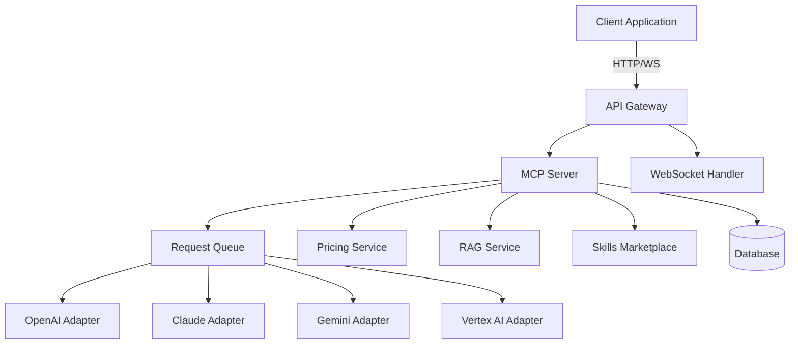
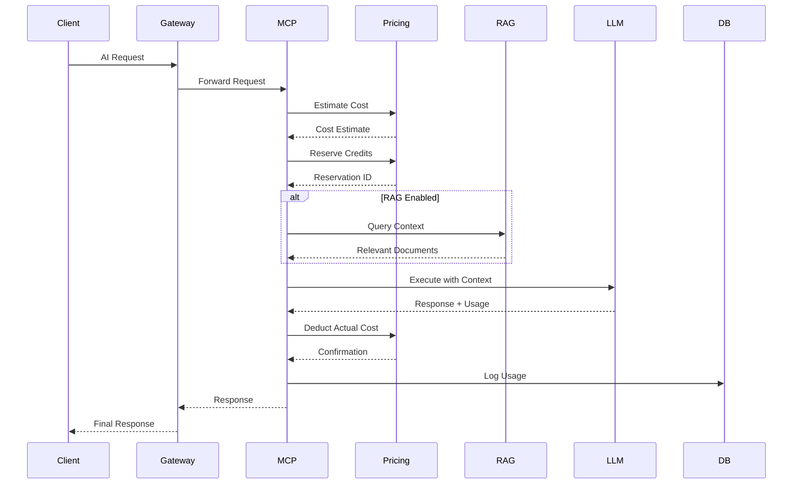
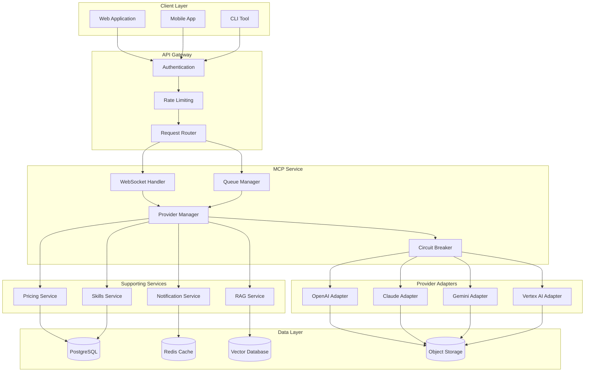
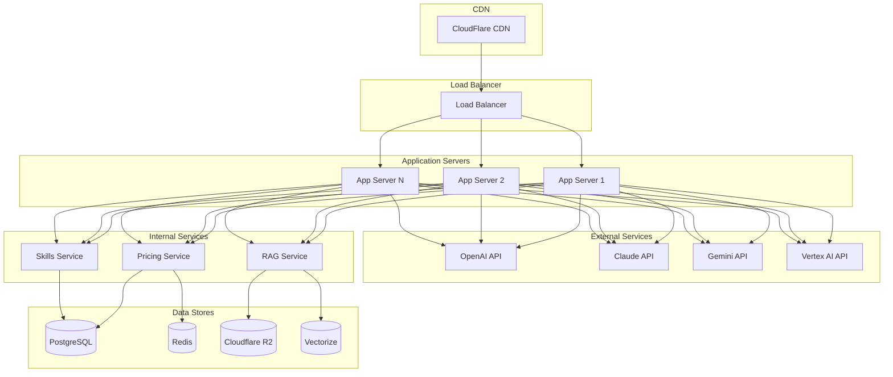

# AI Integration & Model Context Protocol

## Overview

The AI Integration & Model Context Protocol (MCP) feature provides a comprehensive solution for integrating with various Large Language Model (LLM) providers, managing real-time communication via WebSockets, and handling specialized AI workflows including video generation. This system serves as the bridge between the Smart AI Hub platform and external AI services, providing unified access to multiple AI capabilities.

## User Stories

### US-001: Unified AI Model Interface

**As a** platform user
**I want to** interact with different AI models (OpenAI, Claude, Gemini, etc.) through a single unified interface
**So that** I can leverage the best AI capabilities for my specific needs without learning multiple APIs

#### Acceptance Scenarios

**Scenario 1: User selects AI model**
- **Given** I am logged into the platform
- **When** I select an AI model from the dropdown
- **Then** the interface should adapt to show model-specific options
- **And** I should see the estimated cost for my request

**Scenario 2: Automatic fallback on provider failure**
- **Given** I have submitted a request to OpenAI
- **When** OpenAI service is unavailable
- **Then** the system should automatically fallback to Claude
- **And** I should be notified about the provider switch
- **And** my request should be processed without interruption

### US-002: Real-time Streaming Responses

**As a** platform user
**I want to** receive real-time streaming responses from AI models
**So that** I can see results as they are generated and provide feedback during generation

#### Acceptance Scenarios

**Scenario 1: Streaming response initiation**
- **Given** I am connected to the platform
- **When** I submit a request with streaming enabled
- **Then** the system should establish a WebSocket connection
- **And** I should receive the first chunk within 200ms

**Scenario 2: Stream interruption handling**
- **Given** I am receiving a streaming response
- **When** the connection is interrupted
- **Then** the system should attempt to reconnect automatically
- **And** I should receive the remaining response when reconnected

### US-003: Text-to-Video Generation

**As a** content creator
**I want to** generate videos from text prompts
**So that** I can create visual content for my projects without video production skills

#### Acceptance Scenarios

**Scenario 1: Standard video generation**
- **Given** I have sufficient credits
- **When** I submit a text prompt with video parameters
- **Then** the system should validate the request and queue it for processing
- **And** I should receive a video ID for tracking
- **And** the video should be completed within 5 minutes

**Scenario 2: Enhanced GPT-assisted workflow**
- **Given** I select the GPT-assisted workflow
- **When** I provide an initial prompt
- **Then** a Custom GPT should analyze and enhance the prompt
- **And** the enhanced prompt should be used for video generation
- **And** the final video should have improved quality

### US-004: Provider Fallback Management

**As a** system administrator
**I want to** configure automatic fallback between AI providers
**So that** I can ensure service availability and optimal performance

#### Acceptance Scenarios

**Scenario 1: Configuring provider priority**
- **Given** I am logged in as an administrator
- **When** I access the provider configuration panel
- **Then** I should be able to set provider priority order
- **And** I should be able to configure fallback thresholds
- **And** the configuration should be applied immediately

**Scenario 2: Monitoring fallback events**
- **Given** fallback events are occurring
- **When** I access the monitoring dashboard
- **Then** I should see real-time fallback statistics
- **And** I should receive alerts for excessive fallbacks
- **And** I should be able to investigate root causes

### US-005: Usage and Cost Tracking

**As a** platform user
**I want to** track my AI usage and associated costs
**So that** I can manage my resources effectively and optimize my spending

#### Acceptance Scenarios

**Scenario 1: Real-time usage tracking**
- **Given** I am actively using AI services
- **When** I check my usage dashboard
- **Then** I should see real-time token consumption
- **And** I should see associated costs for each request
- **And** I should see my remaining credit balance

**Scenario 2: Cost estimation before requests**
- **Given** I am preparing to make an AI request
- **When** I configure my request parameters
- **Then** the system should provide an estimated cost
- **And** I should see if I have sufficient credits
- **And** I should receive a warning if the cost exceeds my balance

### US-006: Standardized AI APIs

**As a** developer
**I want to** access standardized APIs for AI interactions
**So that** I can build AI-powered features efficiently without managing multiple provider integrations

#### Acceptance Scenarios

**Scenario 1: Unified API endpoint**
- **Given** I am developing an application
- **When** I make a request to the unified AI API
- **Then** the request should be routed to the appropriate provider
- **And** I should receive a standardized response format
- **And** I should not need to handle provider-specific authentication

**Scenario 2: SDK integration**
- **Given** I am using the Smart AI Hub SDK
- **When** I initialize the AI client
- **Then** I should be able to make requests with a single line of code
- **And** the SDK should handle all provider switching automatically
- **And** I should receive typed responses with proper TypeScript support

### US-007: Custom GPT Integration

**As a** Custom GPT creator
**I want to** integrate my Custom GPT with Smart-AI-Hub
**So that** I can leverage the platform's features (RAG, pricing, analytics)

#### Acceptance Scenarios

**Scenario 1: Connect Custom GPT**
- **Given** I have created a Custom GPT on OpenAI
- **When** I provide the GPT ID and API key
- **Then** the system should validate the connection
- **And** my Custom GPT should appear in my agent list

**Scenario 2: Use Custom GPT with RAG**
- **Given** I have connected my Custom GPT
- **When** I enable RAG for this GPT
- **Then** the GPT should have access to my documents
- **And** responses should include relevant context from my knowledge base

### US-008: Gemini Gems Integration

**As a** Gemini Gem creator
**I want to** integrate my Gemini Gems with Smart-AI-Hub
**So that** I can use them within the platform ecosystem

#### Acceptance Scenarios

**Scenario 1: Connect Gemini Gem**
- **Given** I have created a Gem in Google AI Studio
- **When** I provide the Gem ID and credentials
- **Then** the system should validate the connection
- **And** my Gem should appear in my agent list

**Scenario 2: Execute Gemini Gem**
- **Given** I have connected my Gemini Gem
- **When** I send a request to the Gem
- **Then** the system should route the request to Gemini API
- **And** I should receive the response in the standardized format

### US-009: Claude Skills Integration

**As a** Claude Skill developer
**I want to** integrate my Claude Skills with Smart-AI-Hub
**So that** I can deploy them to users through the platform

#### Acceptance Scenarios

**Scenario 1: Connect Claude Skill**
- **Given** I have developed a Claude Skill
- **When** I provide the skill configuration
- **Then** the system should validate the skill definition
- **And** my skill should be available in the skills marketplace

**Scenario 2: Claude Skill with MCP**
- **Given** I have a Claude Skill that uses MCP tools
- **When** the skill is executed
- **Then** the MCP server should provide the required tools
- **And** the skill should access platform resources securely

### US-010: Vertex AI Agent Builder Integration

**As a** Vertex AI developer
**I want to** integrate my Vertex AI agents with Smart-AI-Hub
**So that** I can leverage Google's enterprise AI capabilities

#### Acceptance Scenarios

**Scenario 1: Connect Vertex AI Agent**
- **Given** I have created an agent in Vertex AI
- **When** I provide the agent ID and service account
- **Then** the system should establish a secure connection
- **And** my agent should be available in the platform

**Scenario 2: Vertex AI with Enterprise Features**
- **Given** I have a Vertex AI agent with enterprise features
- **When** the agent processes sensitive data
- **Then** the system should maintain enterprise security standards
- **And** all data should remain within the configured VPC

### US-011: MCP Server Support

**As a** developer
**I want to** connect external applications via MCP protocol
**So that** I can integrate Smart-AI-Hub capabilities with other tools

#### Acceptance Scenarios

**Scenario 1: Claude Desktop Connection**
- **Given** I have Claude Desktop installed
- **When** I configure the MCP server connection
- **Then** Claude Desktop should discover available tools
- **And** I should be able to use platform features from Claude

**Scenario 2: Custom MCP Client**
- **Given** I am developing a custom MCP client
- **When** I connect to the Smart AI Hub MCP server
- **Then** I should receive the list of available tools and resources
- **And** I should be able to execute tools with proper authentication

## Acceptance Criteria

### LLM Provider Integration

- [x] System supports multiple LLM providers (OpenAI, Claude, etc.)
- [x] Provider switching is transparent to end users
- [x] Automatic fallback when primary provider fails
- [x] Provider-specific configurations are properly managed
- [x] Rate limiting and quota management are implemented

### Agent Platforms Integration

- [ ] System supports Custom GPT integration
- [ ] System supports Gemini Gems integration
- [ ] System supports Claude Skills integration
- [ ] System supports Vertex AI Agent Builder integration
- [ ] Platform switching is transparent to end users
- [ ] Platform-specific features are properly handled

### MCP Server Implementation

- [ ] MCP server follows Anthropic specification
- [ ] Claude Desktop can connect to the server
- [ ] Tools are properly registered and callable
- [ ] Resources are accessible via MCP protocol
- [ ] Prompts are available for common tasks

### RAG Integration

- [ ] Agents can access documents from RAG system
- [ ] Access control is properly enforced
- [ ] Context is injected before LLM calls
- [ ] Semantic search results are relevant
- [ ] RAG costs are tracked and billed

### Pricing Integration

- [ ] Cost estimation is available before requests
- [ ] Credits are reserved before expensive operations
- [ ] Actual usage is tracked accurately
- [ ] Nested agent calls are properly billed
- [ ] Usage logs include all cost components

### Real-time Communication

- [x] WebSocket connections are established and maintained
- [x] Streaming responses are delivered in real-time
- [x] Connection failures are handled gracefully
- [x] Multiple concurrent sessions are supported
- [x] Connection state is properly synchronized

### Video Generation

- [x] Text-to-video generation is supported
- [x] Video generation status is tracked
- [x] Generated videos are accessible via URLs
- [x] Video metadata is properly stored
- [x] Generation failures are handled appropriately

### Usage Tracking and Billing

- [x] Token usage is accurately tracked
- [x] Credits are deducted based on usage
- [x] Usage reports are generated
- [x] Billing information is properly recorded
- [x] Usage limits are enforced

### Security and Performance

- [x] All requests are properly authenticated
- [x] Input validation and sanitization are implemented
- [x] Circuit breaker pattern prevents cascading failures
- [x] WebSocket connection establishment < 100ms (p95)
- [x] First token latency < 200ms (p95)
- [x] Streaming throughput > 100 tokens/second
- [x] Provider fallback time < 2 seconds
- [x] API response time < 500ms for non-streaming (p95)
- [x] Error rates are within acceptable limits (< 1%)

## Technical Requirements

### System Architecture

#### Core Components

- **MCP Server**: Central service handling AI provider integrations
- **WebSocket Handler**: Manages real-time bidirectional communication
- **Provider Adapters**: Standardized interfaces for different AI providers
- **Request Queue**: BullMQ for managing request processing
- **Circuit Breaker**: Fault tolerance for provider failures

#### Technology Stack

- **Runtime**: Node.js 20 LTS
- **Framework**: Express.js 4.x
- **Port**: 3003
- **Language**: TypeScript 5.x
- **WebSocket**: ws library
- **Queue**: BullMQ for request management
- **Circuit Breaker**: opossum for fault tolerance

### API Endpoints

#### WebSocket Connection

- **Endpoint**: `ws://localhost:3003/mcp`
- **Authentication**: JWT token required
- **Protocol**: Custom JSON-based protocol

#### REST Endpoints

- **Generate Video**: `POST /api/mcp/sora2/generate`
- **Video Status**: `GET /api/mcp/sora2/status/:videoId`
- **GPT Workflow**: `POST /api/mcp/gpt/video-workflow`

#### Custom GPT Endpoints

- **Connect GPT**: `POST /api/mcp/custom-gpt/connect`
- **List GPTs**: `GET /api/mcp/custom-gpt`
- **Execute GPT**: `POST /api/mcp/custom-gpt/:gptId/execute`
- **Disconnect GPT**: `DELETE /api/mcp/custom-gpt/:gptId`

#### Gemini Gems Endpoints

- **Connect Gem**: `POST /api/mcp/gemini-gems/connect`
- **List Gems**: `GET /api/mcp/gemini-gems`
- **Execute Gem**: `POST /api/mcp/gemini-gems/:gemId/execute`
- **Disconnect Gem**: `DELETE /api/mcp/gemini-gems/:gemId`

#### Claude Skills Endpoints

- **Connect Skill**: `POST /api/mcp/claude-skills/connect`
- **List Skills**: `GET /api/mcp/claude-skills`
- **Execute Skill**: `POST /api/mcp/claude-skills/:skillId/execute`
- **Disconnect Skill**: `DELETE /api/mcp/claude-skills/:skillId`

#### Vertex AI Endpoints

- **Connect Agent**: `POST /api/mcp/vertex-ai/connect`
- **List Agents**: `GET /api/mcp/vertex-ai`
- **Execute Agent**: `POST /api/mcp/vertex-ai/:agentId/execute`
- **Disconnect Agent**: `DELETE /api/mcp/vertex-ai/:agentId`

#### MCP Server Endpoints

- **List Tools**: `GET /api/mcp/server/tools`
- **List Resources**: `GET /api/mcp/server/resources`
- **List Prompts**: `GET /api/mcp/server/prompts`
- **Call Tool**: `POST /api/mcp/server/tools/:toolName`
- **Read Resource**: `GET /api/mcp/server/resources/:resourceUri`

### Data Models

#### MCP Request

```typescript
interface MCPRequest {
  id: string;
  type: 'completion' | 'chat' | 'embedding';
  provider: 'openai' | 'claude' | 'auto';
  model: string;
  messages?: Message[];
  prompt?: string;
  stream: boolean;
  maxTokens?: number;
}
```

#### MCP Response

```typescript
interface MCPResponse {
  id: string;
  type: 'completion';
  data: string;
  usage: {
    promptTokens: number;
    completionTokens: number;
    totalTokens: number;
    credits: number;
  };
  metadata: {
    model: string;
    provider: string;
    latency: number;
  };
}
```

#### Video Request

```typescript
interface Sora2VideoRequest {
  prompt: string;
  duration: number; // seconds
  resolution: '720p' | '1080p' | '4K';
  style?: string;
  aspectRatio?: string;
  userId: string;
  sessionId: string;
}
```

#### Video Response

```typescript
interface Sora2VideoResponse {
  videoId: string;
  status: 'processing' | 'completed' | 'failed';
  url?: string;
  thumbnailUrl?: string;
  duration: number;
  creditsUsed: number;
  createdAt: string;
  completedAt?: string;
}
```

#### Agent Platform Data Models

```typescript
// Custom GPT
interface CustomGPTConfig {
  gptId: string;
  name: string;
  description: string;
  instructions: string;
  tools: CustomGPTTool[];
  fileIds?: string[];
  metadata: Record<string, any>;
}

interface CustomGPTTool {
  type: 'function';
  function: {
    name: string;
    description: string;
    parameters: Record<string, any>;
  };
}

// Gemini Gem
interface GeminiGemConfig {
  gemId: string;
  name: string;
  description: string;
  systemInstruction: string;
  tools: GeminiTool[];
  groundingConfig?: GroundingConfig;
}

interface GeminiTool {
  functionDeclarations: {
    name: string;
    description: string;
    parameters?: Record<string, any>;
  }[];
}

interface GroundingConfig {
  groundingSources?: string[];
  dynamicRetrievalConfig?: {
    mode: 'MODE_DYNAMIC' | 'MODE_OFF';
    dynamicThreshold?: number;
  };
}

// Claude Skill
interface ClaudeSkillConfig {
  skillId: string;
  name: string;
  description: string;
  instructions: string;
  tools: ClaudeTool[];
  mcpServers?: MCPServerConfig[];
}

interface ClaudeTool {
  name: string;
  description: string;
  input_schema: Record<string, any>;
}

interface MCPServerConfig {
  name: string;
  command: string;
  args?: string[];
  env?: Record<string, string>;
}

// Vertex AI Agent
interface VertexAIAgentConfig {
  agentId: string;
  projectId: string;
  location: string;
  dataStores: string[];
  tools: VertexAITool[];
}

interface VertexAITool {
  toolType: 'function' | 'retrieval' | 'googleSearch';
  functionDeclaration?: {
    name: string;
    description: string;
    parameters?: Record<string, any>;
  };
  retrieval?: {
    dataStores: string[];
  };
}
```

### Business Logic

#### Provider Fallback Strategy

```typescript
const providerPriority = ['openai', 'claude'];

async function executeWithFallback(request: MCPRequest): Promise<MCPResponse> {
  let lastError: Error;

  for (const provider of providerPriority) {
    try {
      const result = await providers[provider].execute(request);
      return result;
    } catch (error) {
      lastError = error;
      logger.warn(`Provider ${provider} failed, trying next`, { error });

      if (error.code === 'RATE_LIMIT_EXCEEDED') {
        await sleep(5000);
      }
    }
  }

  throw new AppError('ALL_PROVIDERS_FAILED', 'All LLM providers failed', { lastError });
}
```

#### Circuit Breaker Implementation

```typescript
import CircuitBreaker from 'opossum';

const options = {
  timeout: 30000, // 30 seconds
  errorThresholdPercentage: 50,
  resetTimeout: 30000, // Try again after 30s
};

const breaker = new CircuitBreaker(callOpenAI, options);

breaker.on('open', () => {
  logger.error('Circuit breaker opened for OpenAI');
  // Switch to Claude
});
```

### Integration Points

#### Sora2 Video Generation API

- Text-to-video conversion
- Custom style and resolution options
- Asynchronous processing with status tracking
- CDN integration for video delivery

#### Custom GPT Integration

- Enhanced video generation workflows
- Prompt optimization and enhancement
- Multi-step AI processing pipelines
- Context-aware video generation

## Integration with Pricing System (FR-PRICING-001)

### Overview

The AI Integration service integrates with the Pricing System to provide accurate cost estimation, credit reservation, and usage tracking for all AI operations.

### Integration Flow

1. **Before AI Request**:
   ```typescript
   // Estimate cost
   const estimation = await pricingService.estimate({
     platform: 'openai',
     model: 'gpt-4',
     inputTokens: request.messages.reduce((sum, m) => sum + m.content.length / 4, 0),
     outputTokens: request.maxTokens || 1000,
     features: request.enableRAG ? ['rag'] : []
   });
   
   // Reserve credits
   const reservation = await creditReservationService.reserve({
     userId: request.userId,
     amount: estimation.totalCost,
     reason: `AI request: ${request.model}`
   });
   ```

2. **During AI Request**:
   ```typescript
   // Execute request
   const response = await mcpService.execute(request);
   ```

3. **After AI Request**:
   ```typescript
   // Deduct actual cost
   await pricingService.deduct({
     userId: request.userId,
     reservationId: reservation.id,
     actualUsage: {
       inputTokens: response.usage.promptTokens,
       outputTokens: response.usage.completionTokens,
       features: response.metadata.features
     }
   });
   
   // Log usage
   await usageTrackingService.log({
     userId: request.userId,
     platform: response.metadata.provider,
     model: response.metadata.model,
     usage: response.usage,
     cost: response.usage.credits
   });
   ```

### Error Handling

If the AI request fails, credits are released:

```typescript
try {
  const response = await mcpService.execute(request);
  await pricingService.deduct(...);
} catch (error) {
  await creditReservationService.release(reservation.id);
  throw error;
}
```

## Integration with RAG System (FR-RAG-001)

### Overview

The AI Integration service integrates with the RAG System to provide context-aware responses by injecting relevant document chunks before LLM calls.

### Integration Flow

1. **Before LLM Call**:
   ```typescript
   // Check if RAG is enabled
   if (request.enableRAG && request.agentId) {
     // Query RAG for relevant context
     const ragResults = await ragService.query({
       query: request.messages[request.messages.length - 1].content,
       agentId: request.agentId,
       topK: 5,
       filters: {
         accessLevel: request.ragAccessLevel || 'agent'
       }
     });
     
     // Inject context into messages
     if (ragResults.results.length > 0) {
       const context = ragResults.results.map(r => r.content).join('\n\n');
       request.messages.unshift({
         role: 'system',
         content: `Use the following context to answer the user's question:\n\n${context}`
       });
     }
   }
   ```

2. **During LLM Call**:
   ```typescript
   // Execute with injected context
   const response = await llmProvider.execute(request);
   ```

3. **After LLM Call**:
   ```typescript
   // Track RAG usage
   if (request.enableRAG) {
     await usageTrackingService.logRAGUsage({
       userId: request.userId,
       agentId: request.agentId,
       queryId: ragResults.queryId,
       documentsAccessed: ragResults.results.length,
       cost: ragResults.cost
     });
   }
   ```

### Access Control

The RAG integration enforces access control at multiple levels:

```typescript
// Filter results based on user permissions
const filteredResults = ragResults.results.filter(result => {
  // Check document access level
  if (result.accessLevel === 'private' && result.userId !== request.userId) {
    return false;
  }
  
  // Check organization access
  if (result.accessLevel === 'organization' && result.organizationId !== user.organizationId) {
    return false;
  }
  
  // Check agent-specific access
  if (result.accessLevel === 'agent' && !result.sharedWithAgentIds.includes(request.agentId)) {
    return false;
  }
  
  return true;
});
```

## Integration with Skills Marketplace (FR-SKILLS-001)

### Overview

The AI Integration service integrates with the Skills Marketplace to enable execution of published skills across different agent platforms.

### Integration Flow

1. **Skill Discovery**:
   ```typescript
   // Get available skills for user
   const skills = await skillsService.getInstalledSkills({
     userId: request.userId,
     platform: request.platform,
     category: request.category
   });
   ```

2. **Skill Selection**:
   ```typescript
   // User selects a skill
   const selectedSkill = skills.find(s => s.id === request.skillId);
   
   // Validate skill compatibility
   if (!isSkillCompatible(selectedSkill, request)) {
     throw new Error('Skill is not compatible with this request');
   }
   ```

3. **Skill Execution**:
   ```typescript
   // Execute skill with platform-specific adapter
   const response = await platformAdapters[selectedSkill.platform].executeSkill({
     skillId: selectedSkill.id,
     versionId: selectedSkill.latestVersionId,
     input: request.input,
     context: {
       userId: request.userId,
       sessionId: request.sessionId,
       ragEnabled: request.enableRAG
     }
   });
   ```

4. **Usage Tracking**:
   ```typescript
   // Track skill usage
   await skillsService.trackUsage({
     skillId: selectedSkill.id,
     userId: request.userId,
     executionTime: response.executionTime,
     success: response.success,
     error: response.error
   });
   ```

### Skill Compatibility Matrix

```typescript
interface SkillCompatibility {
  platform: string;
  supportedFeatures: string[];
  requiredPermissions: string[];
  maxInputSize: number;
  supportedMimeTypes: string[];
}

const COMPATIBILITY_MATRIX: Record<string, SkillCompatibility> = {
  'custom-gpt': {
    platform: 'openai',
    supportedFeatures: ['function-calling', 'code-interpreter', 'file-upload'],
    requiredPermissions: ['gpt-access'],
    maxInputSize: 100000, // 100KB
    supportedMimeTypes: ['text/plain', 'application/pdf', 'application/json']
  },
  'gemini-gems': {
    platform: 'google',
    supportedFeatures: ['function-calling', 'grounding', 'code-execution'],
    requiredPermissions: ['gemini-access'],
    maxInputSize: 200000, // 200KB
    supportedMimeTypes: ['text/plain', 'application/pdf', 'image/jpeg', 'image/png']
  },
  'claude-skills': {
    platform: 'anthropic',
    supportedFeatures: ['function-calling', 'mcp-tools', 'artifacts'],
    requiredPermissions: ['claude-access'],
    maxInputSize: 150000, // 150KB
    supportedMimeTypes: ['text/plain', 'application/pdf', 'text/markdown']
  },
  'vertex-ai': {
    platform: 'google-cloud',
    supportedFeatures: ['function-calling', 'retrieval', 'enterprise-search'],
    requiredPermissions: ['vertex-ai-access'],
    maxInputSize: 500000, // 500KB
    supportedMimeTypes: ['text/plain', 'application/pdf', 'application/json']
  }
};
```

### Performance Requirements

- **WebSocket Response Time**: < 100ms for connection establishment
- **Streaming Latency**: < 200ms for first chunk
- **Video Generation**: Process within 5 minutes for standard requests
- **Provider Fallback**: < 2 seconds for failover
- **Concurrent Connections**: Support 1000+ simultaneous WebSocket connections
- **System Uptime**: 99.9% availability

### Security Requirements

- **Authentication**: JWT token validation for all requests
- **Authorization**: Role-based access control for different AI capabilities
- **Input Validation**: Comprehensive validation and sanitization
- **Rate Limiting**: Request throttling to prevent abuse
- **Audit Logging**: Complete audit trail for AI interactions
- **Data Privacy**: Secure handling of sensitive prompts and responses

## Implementation Details

### WebSocket Protocol

#### Connection Flow

1. Client initiates WebSocket connection with JWT token
2. Server validates token and establishes connection
3. Client sends MCP request with specified parameters
4. Server routes to appropriate provider and begins processing
5. Response streams back in real-time chunks
6. Connection remains open for additional requests

#### Message Formats

```typescript
// Client → Server
{
  "id": "req-123",
  "type": "completion",
  "provider": "openai",
  "model": "gpt-4",
  "messages": [...],
  "stream": true,
  "maxTokens": 1000
}

// Server → Client (Streaming)
{
  "id": "req-123",
  "type": "chunk",
  "data": "Partial response..."
}

// Server → Client (Complete)
{
  "id": "req-123",
  "type": "done",
  "usage": {
    "promptTokens": 150,
    "completionTokens": 300,
    "totalTokens": 450,
    "credits": 45
  }
}
```

### Video Generation Workflow

#### Standard Text-to-Video

1. User submits text prompt and parameters
2. System validates request and checks credits
3. Request queued for Sora2 processing
4. Video generation begins asynchronously
5. Status updates provided via WebSocket
6. Completed video delivered via CDN

#### Enhanced GPT-Assisted Workflow

1. User provides initial prompt and workflow type
2. Custom GPT analyzes and enhances the prompt
3. Enhanced prompt used for video generation
4. Additional processing steps applied based on workflow
5. Final video delivered with enhanced quality

### Error Handling

#### Provider Errors

- **Rate Limiting**: Automatic backoff and retry
- **Quota Exceeded**: Switch to alternative provider
- **Model Unavailable**: Fallback to similar model
- **API Failure**: Circuit breaker activation

#### System Errors

- **WebSocket Disconnection**: Automatic reconnection
- **Queue Overflow**: Load shedding with notification
- **Credit Insufficient**: Clear error with upgrade options
- **Validation Errors**: Detailed feedback for correction

### Monitoring and Observability

#### Key Metrics

- Request/response latency
- Provider success rates
- Token usage patterns
- Error rates by type
- Connection metrics

#### Alerting

- Provider failure rates > 10%
- Response times > 5 seconds
- Error rates > 5%
- Queue depth > 1000
- Circuit breaker activations

## Testing Strategy (Detailed)

### Test Coverage Targets

| Test Type | Target Coverage | Tools |
|-----------|----------------|-------|
| Unit Tests | 80% | Jest, ts-jest |
| Integration Tests | 70% | Jest, Supertest |
| E2E Tests | 50% | Playwright |
| API Tests | 100% | Postman, Newman |

### Test Automation

#### CI/CD Pipeline

```yaml
# .github/workflows/test.yml
name: Test AI Integration

on: [push, pull_request]

jobs:
  test:
    runs-on: ubuntu-latest
    steps:
      - uses: actions/checkout@v4
      - uses: actions/setup-node@v4
        with:
          node-version: 22
      
      - name: Install dependencies
        run: npm ci
      
      - name: Run linter
        run: npm run lint
      
      - name: Run unit tests
        run: npm run test:unit -- --coverage
      
      - name: Run integration tests
        run: npm run test:integration
      
      - name: Upload coverage
        uses: codecov/codecov-action@v3
```

### Test Scenarios

#### Unit Tests

**Provider Adapters**:
- [ ] OpenAI adapter handles successful requests
- [ ] OpenAI adapter handles rate limiting
- [ ] OpenAI adapter handles API errors
- [ ] Claude adapter handles successful requests
- [ ] Fallback mechanism works correctly

**WebSocket Handler**:
- [ ] Connection establishment
- [ ] Message parsing
- [ ] Streaming responses
- [ ] Connection cleanup
- [ ] Error handling

**Circuit Breaker**:
- [ ] Opens on repeated failures
- [ ] Closes after timeout
- [ ] Half-open state works
- [ ] Metrics are tracked

#### Integration Tests

**End-to-End Flows**:
- [ ] Complete AI request flow (request → response)
- [ ] Provider fallback on failure
- [ ] Credit reservation and deduction
- [ ] RAG context injection
- [ ] Video generation workflow

**API Tests**:
- [ ] All endpoints return correct status codes
- [ ] Request validation works
- [ ] Authentication is enforced
- [ ] Rate limiting works
- [ ] Error responses are consistent

#### Performance Tests

**Load Testing**:
- [ ] 1000 concurrent WebSocket connections
- [ ] 100 requests/second sustained for 10 minutes
- [ ] Memory usage remains stable under load
- [ ] Response time degradation is minimal

**Stress Testing**:
- [ ] System behavior under extreme load
- [ ] Graceful degradation when resources are exhausted
- [ ] Recovery after load subsides

## OpenAPI Specification

The complete OpenAPI 3.0 specification is available at `specs/006-ai-integration/contracts/openapi.yaml`. Below are key endpoint definitions:

### Video Generation Endpoints

```yaml
paths:
  /api/mcp/sora2/generate:
    post:
      summary: Generate video from text
      tags:
        - Video Generation
      requestBody:
        required: true
        content:
          application/json:
            schema:
              $ref: '#/components/schemas/Sora2VideoRequest'
      responses:
        '200':
          description: Video generation started
          content:
            application/json:
              schema:
                $ref: '#/components/schemas/Sora2VideoResponse'
        '400':
          description: Invalid request
        '401':
          description: Unauthorized
        '402':
          description: Insufficient credits

components:
  schemas:
    Sora2VideoRequest:
      type: object
      required:
        - prompt
        - duration
        - resolution
      properties:
        prompt:
          type: string
          description: Text prompt for video generation
          example: "A beautiful sunset over the ocean"
        duration:
          type: integer
          description: Video duration in seconds
          minimum: 1
          maximum: 60
          example: 10
        resolution:
          type: string
          enum: ['720p', '1080p', '4K']
          example: '1080p'
        style:
          type: string
          description: Visual style
          example: "cinematic"
        aspectRatio:
          type: string
          example: "16:9"

    Sora2VideoResponse:
      type: object
      properties:
        videoId:
          type: string
          example: "vid_abc123"
        status:
          type: string
          enum: ['processing', 'completed', 'failed']
          example: "processing"
        url:
          type: string
          nullable: true
          example: "https://cdn.example.com/videos/vid_abc123.mp4"
        thumbnailUrl:
          type: string
          nullable: true
        duration:
          type: integer
          example: 10
        creditsUsed:
          type: number
          example: 150.5
        createdAt:
          type: string
          format: date-time
        completedAt:
          type: string
          format: date-time
          nullable: true
```

### Agent Platform Endpoints

```yaml
  /api/mcp/custom-gpt/connect:
    post:
      summary: Connect Custom GPT
      tags:
        - Custom GPT
      requestBody:
        required: true
        content:
          application/json:
            schema:
              type: object
              required:
                - gptId
                - apiKey
              properties:
                gptId:
                  type: string
                  description: GPT ID from OpenAI
                apiKey:
                  type: string
                  description: API key for GPT access
                name:
                  type: string
                  description: Custom name for the GPT
      responses:
        '200':
          description: GPT connected successfully
        '400':
          description: Invalid GPT ID or API key
        '401':
          description: Authentication failed

  /api/mcp/custom-gpt/{gptId}/execute:
    post:
      summary: Execute Custom GPT
      tags:
        - Custom GPT
      parameters:
        - name: gptId
          in: path
          required: true
          schema:
            type: string
      requestBody:
        required: true
        content:
          application/json:
            schema:
              type: object
              required:
                - input
              properties:
                input:
                  type: string
                  description: Input prompt for the GPT
                enableRAG:
                  type: boolean
                  description: Enable RAG context injection
                sessionId:
                  type: string
                  description: Session ID for context tracking
      responses:
        '200':
          description: GPT execution completed
          content:
            application/json:
              schema:
                type: object
                properties:
                  output:
                    type: string
                  usage:
                    $ref: '#/components/schemas/UsageMetrics'
                  cost:
                    $ref: '#/components/schemas/CostBreakdown'
```

## Architecture Diagrams

### System Architecture



### Request Flow Sequence



### Component Diagram



### Deployment Architecture



## Implementation Timeline

### Phase 1: Foundation (Weeks 1-8)
**Duration**: 2 months
**Team**: 2 developers

#### Week 1-2: Complete Existing Features
- [x] Finish all unchecked acceptance criteria
- [ ] Fix known bugs
- [ ] Implement circuit breaker
- [ ] Add comprehensive error handling

#### Week 3-4: Pricing Integration
- [ ] Integrate with FR-PRICING-001
- [ ] Implement cost estimation
- [ ] Implement credit reservation
- [ ] Add usage tracking

#### Week 5-6: Technology Upgrade
- [ ] Upgrade Express.js to 5.x or migrate to Fastify
- [ ] Update dependencies
- [ ] Refactor for better performance
- [ ] Add caching layer

#### Week 7-8: Testing & Documentation
- [ ] Write unit tests (target: 80% coverage)
- [ ] Write integration tests
- [ ] Create OpenAPI specification
- [ ] Update documentation

### Phase 2: Agent Platforms (Weeks 9-16)
**Duration**: 2 months
**Team**: 2 developers

#### Week 9-10: Custom GPT
- [ ] Implement Custom GPT adapter
- [ ] Add API endpoints
- [ ] Test integration
- [ ] Document usage

#### Week 11-12: Gemini Gems
- [ ] Implement Gemini Gems adapter
- [ ] Add API endpoints
- [ ] Test integration
- [ ] Document usage

#### Week 13-14: Claude Skills
- [ ] Implement Claude Skills adapter
- [ ] Add API endpoints
- [ ] Test integration
- [ ] Document usage

#### Week 15-16: Vertex AI Agent Builder
- [ ] Implement Vertex AI adapter
- [ ] Add API endpoints
- [ ] Test integration
- [ ] Document usage

### Phase 3: RAG & MCP (Weeks 17-24)
**Duration**: 2 months
**Team**: 2 developers

#### Week 17-18: RAG Integration
- [ ] Integrate with FR-RAG-001
- [ ] Implement context injection
- [ ] Test access control
- [ ] Optimize performance

#### Week 19-20: MCP Server
- [ ] Implement MCP server (Anthropic spec)
- [ ] Register tools
- [ ] Register resources
- [ ] Test with Claude Desktop

#### Week 21-22: Advanced Features
- [ ] Add multi-modal support
- [ ] Implement response caching
- [ ] Add agent workflows
- [ ] Optimize costs

#### Week 23-24: Final Testing & Deployment
- [ ] E2E testing
- [ ] Performance testing
- [ ] Security testing
- [ ] Production deployment

**Total Duration**: 6 months
**Total Cost**: ~1.06M THB

## Deployment Considerations

### Environment Configuration

- Development: Local LLM instances, mock providers
- Staging: Production-like environment with limited quotas
- Production: Full provider integration with monitoring

### Scaling Strategy

- Horizontal scaling for WebSocket handlers
- Provider-specific connection pooling
- Queue-based load distribution
- Auto-scaling based on connection metrics

### Backup and Recovery

- Provider configuration backups
- Request queue persistence
- Connection state recovery
- Disaster recovery procedures

## Deployment Strategy

### Blue-Green Deployment

1. **Setup**:
   - Maintain two identical environments (Blue and Green)
   - Blue = current production
   - Green = new version

2. **Deployment Process**:
   ```bash
   # Deploy to Green environment
   npm run deploy:green
   
   # Run smoke tests
   npm run test:smoke -- --env=green
   
   # Switch traffic to Green (gradual)
   kubectl patch service mcp-service -p '{"spec":{"selector":{"version":"green"}}}'
   
   # Monitor metrics for 30 minutes
   npm run monitor -- --duration=30m
   
   # If successful, Green becomes new Blue
   # If failed, rollback to Blue
   ```

3. **Rollback**:
   ```bash
   # Immediate rollback
   kubectl patch service mcp-service -p '{"spec":{"selector":{"version":"blue"}}}'
   ```

### Canary Deployment

1. **Setup**:
   - Deploy new version to small subset of servers (10%)
   - Monitor metrics closely

2. **Gradual Rollout**:
   - 10% → 25% → 50% → 100%
   - Each step requires 1 hour of stable metrics

3. **Rollback Triggers**:
   - Error rate > 1%
   - Response time > 2x baseline
   - Circuit breaker activations > 5/minute
   - Manual trigger

### Feature Flags

Use feature flags for risky changes:

```typescript
if (featureFlags.isEnabled('new-claude-adapter', userId)) {
  return newClaudeAdapter.execute(request);
} else {
  return oldClaudeAdapter.execute(request);
}
```

## Future Enhancements

### Additional Providers

- Google Gemini integration
- Anthropic Claude 3 support
- Local model hosting
- Custom model adapters

### Advanced Features

- Multi-modal AI capabilities
- Custom fine-tuned models
- Agent-based workflows
- Collaborative AI sessions

### Optimization

- Response caching strategies
- Predictive resource allocation
- Intelligent routing
- Cost optimization algorithms

## Cross-References

- [EPIC-002: Financial System & Credits](../004-financial-system/spec.md) - Credit account management
- [FEAT-001: User Management & Profiles](../002-user-management/spec.md) - User authentication and profiles
- [API Documentation](./contracts/api-spec.json) - Detailed API specification
- [Data Model](./data-model.md) - Database schema and relationships
